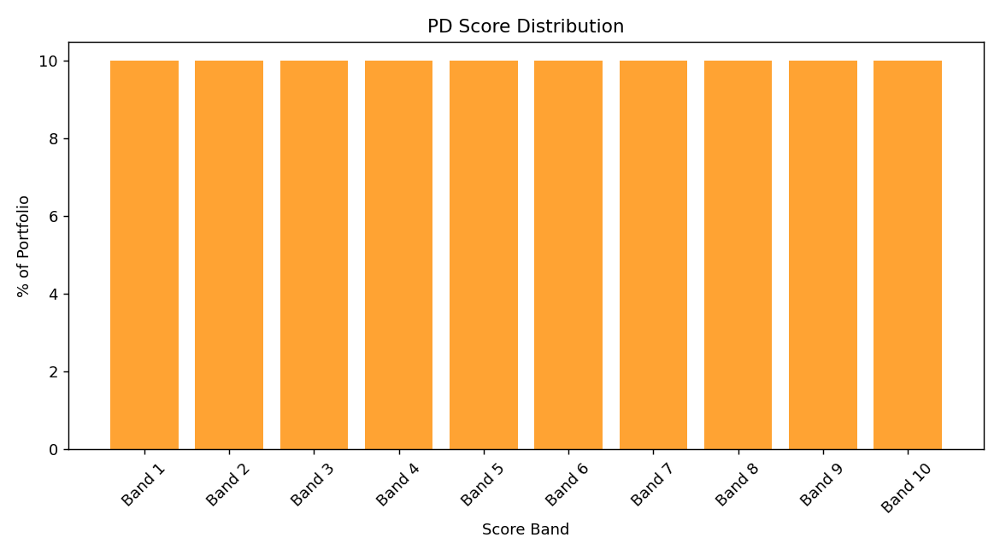

# HelixDecision for AI Underwriting

Turn fragmented lending workflows into one auditable decision pipeline with APIs, policy logic,
modeling, and explainability built in.

[](https://github.com)
[](https://github.com)
[](https://github.com)
[](LICENSE)

## Table of Contents

- [Problem and Solution](#problem-and-solution)
- [Key Features](#key-features)
- [Product Screenshot](#product-screenshot)
- [Installation](#installation)
- [Usage Examples](#usage-examples)
- [Benchmarks and Comparisons](#benchmarks-and-comparisons)
- [Project Structure](#project-structure)
- [Contributing](#contributing)
- [License](#license)
- [Citation](#citation)

## Problem and Solution

Lending teams often run risk scoring, policy checks, compliance, and overrides in separate tools.
That creates inconsistent decisions, slower turn times, and painful audit prep.

This platform gives you one path from application input to final decision:

- Ingest and normalize applicant data.
- Engineer risk features.
- Score risk and fraud.
- Apply policy and produce an explainable decision.
- Track outcomes and keep evidence for compliance review.

Result: faster decisions, fewer manual handoffs, and a clear record of why each decision happened.

## Key Features

- End-to-end decision pipeline: move from applicant payload to decision in one runnable flow.
  Benefit: your team spends less time stitching services together.
- Thin-file underwriting support: uses alternative data when bureau history is sparse.
  Benefit: you can evaluate more applicants without defaulting to reject.
- Multi-agent architecture: specialized agents for ingestion, features, risk, decisions, and
  explainability.
  Benefit: each component is easier to test, replace, and scale independently.
- API-first operations: FastAPI services for scoring, batch processing, health, and metrics.
  Benefit: product teams can integrate with predictable interfaces.
- Compliance and audit tooling: adverse action reasons, retention, override logs, and replay support.
  Benefit: audits are evidence-driven instead of manual reconstruction.
- Progressive canary controls: ramp traffic gradually and auto-rollback on threshold breaches.
  Benefit: safer releases with less operational risk.
- Experiment-ready model governance: champion/challenger paths and model documentation hooks.
  Benefit: you can ship model updates without losing control.

## Product Screenshot

Decision quality output from the running platform:



You can also add a short product GIF in docs/images to show request -> decision -> explanation flow.

## Installation

### Prerequisites

- Python 3.11+
- Git
- Optional for cloud workflows: gcloud CLI and authenticated GCP project

### Open Banking Setup

The bank-enrichment flow is configured through environment variables in `.env`.
For live Plaid runs, set `PLAID_CLIENT_ID` and `PLAID_SECRET` and choose a valid `PLAID_ENV`.
For Open Bank Project, set `OBP_BASE_URL`, `OBP_BANK_ID`, `OBP_ACCESS_TOKEN`, `OBP_CONSUMER_KEY`, and `OBP_CONSUMER_SECRET`.
If these are not set, the connector falls back to mock behavior where supported, which is useful for local development before testing with real providers.

### macOS and Linux

```bash
git clone https://github.com/<your-org>/credit-risk-platform.git
cd credit-risk-platform

python3 -m venv .venv
source .venv/bin/activate
pip install --upgrade pip
pip install -r requirements.txt
```

### Windows (PowerShell)

```powershell
git clone https://github.com/<your-org>/credit-risk-platform.git
cd credit-risk-platform

py -3 -m venv .venv
.\.venv\Scripts\Activate.ps1
python -m pip install --upgrade pip
pip install -r requirements.txt
```

### Optional: start local APIs

```bash
uvicorn agents.api_agent:app --host 0.0.0.0 --port 8080
```

```bash
./start_analytics_api.sh
```

## Usage Examples

### 1) Run full pipeline with built-in sample applicants

```bash
python run_end_to_end.py
```

Use this to validate the full flow quickly, including thin-file scenarios.

### 2) Score a single applicant by API

```bash
curl -X POST http://localhost:8080/v1/score \
	-H "X-API-Key: dev-key-12345" \
	-H "Content-Type: application/json" \
	-d @data/sample_applicant.json
```

Use this when integrating with an application intake service.

### 3) Batch decisioning from CSV

```bash
python run_end_to_end.py \
	--batch data/raw/loan_applications.csv \
	--output /tmp/decisions.json
```

Use this for backfills, simulation runs, and policy change impact analysis.

## Benchmarks and Comparisons

### Operational thresholds (canary release)

The deployment canary script enforces these release thresholds before full promotion:

- p99 latency threshold: 500 ms
- 5xx error rate threshold: 1%

Script: scripts/canary_decision_api.py

### Approach comparison

| Approach | Decision traceability | Policy consistency | Release safety |
|----------|------------------------|--------------------|----------------|
| Spreadsheet and manual review | Low | Low | Low |
| Single-model scoring service only | Medium | Medium | Medium |
| This platform | High | High | High |

To benchmark in your environment, run canary checks and compare latency and error metrics against
your current decision stack.

## Project Structure

Key directories:

- agents: agent orchestration and API entry points
- decision-api: decision service endpoints and health checks
- analytics_api: analytics and monitoring APIs
- compliance: compliance workflows, adverse action, retention, and approvals
- monitoring: model and portfolio monitoring artifacts
- orchestration: end-to-end pipeline orchestration
- scripts: operational scripts, canary tooling, data jobs
- tests: integration and unit test suites

## Contributing

Start here:

1. Read project context in [projectplan.md](projectplan.md).
2. Pick an issue or open one with repro steps and expected behavior.
3. Create a branch: feat/short-description or fix/short-description.
4. Run tests locally before opening a PR:

```bash
pytest -q
```

5. In your PR, include what changed, why it changed, and how you validated it.

If you are adding new model logic, include explainability and monitoring updates in the same PR.

## License

Released under the MIT License. See [LICENSE](LICENSE).

## Citation

If you use this platform in research, internal model governance, or production evaluation, cite:

```bibtex
@software{credit_risk_platform,
	title = {HelixDecision for AI Underwriting},
	year = {2026},
	publisher = {GitHub},
	url = {https://github.com/<your-org>/credit-risk-platform}
}
```
