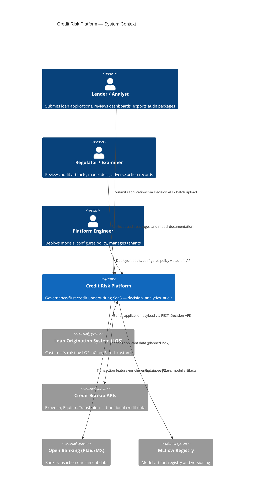
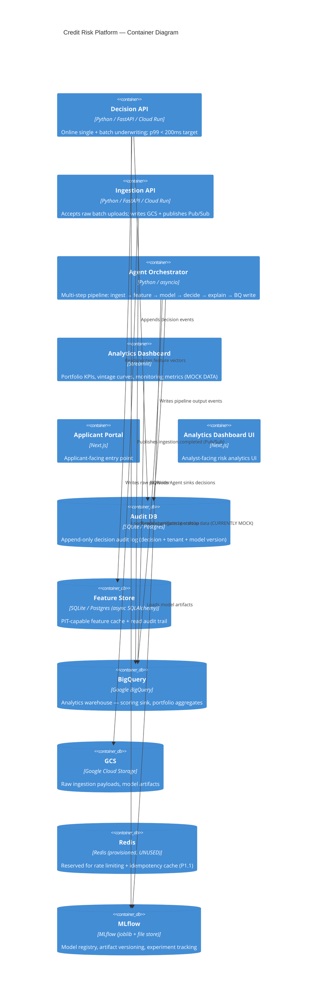
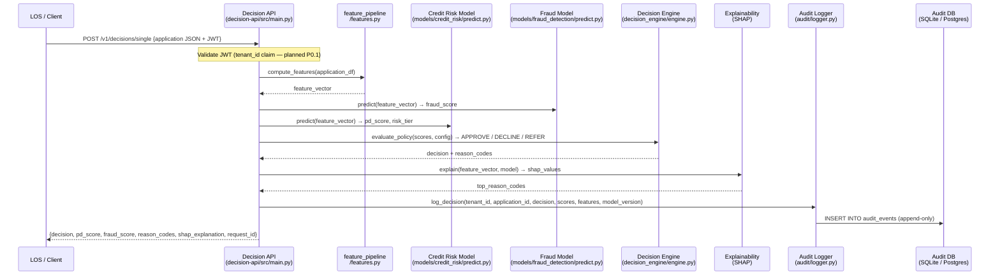
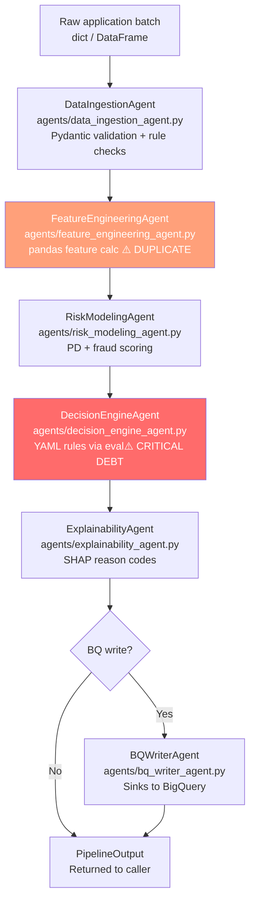
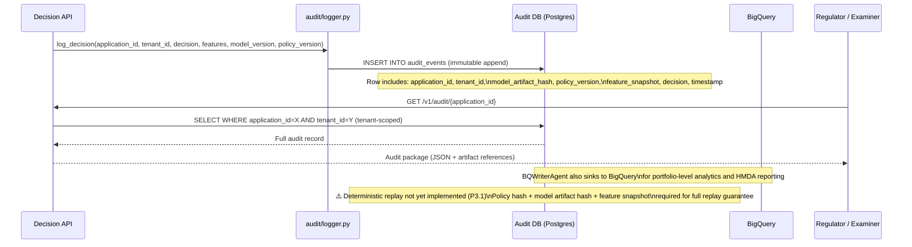
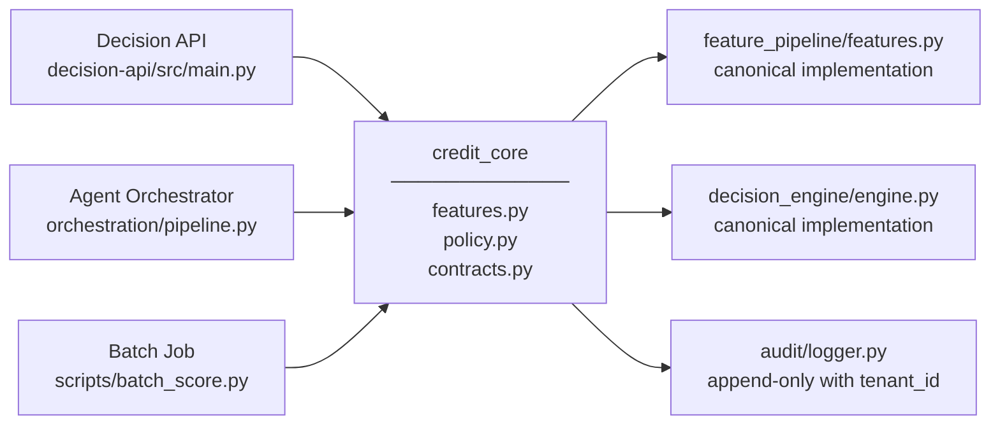
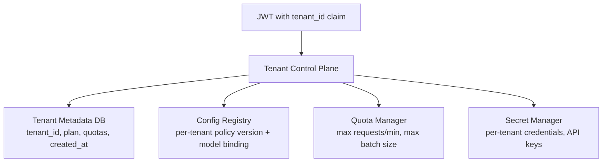
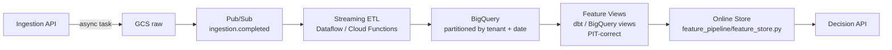
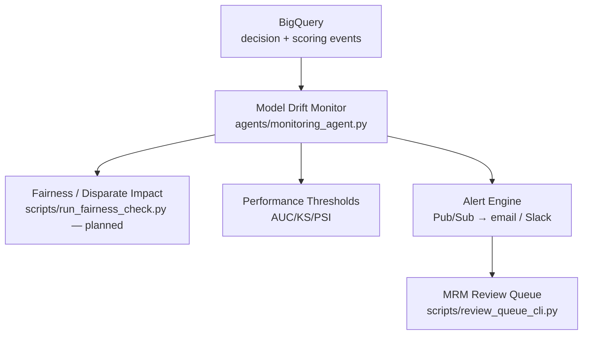

# Technical Architecture Reference
## Credit Risk Platform — `credit-risk-platform`

> Version: 1.0 | Date: 2026-04-07 | Status: DRAFT
> Audience: Engineering hires, technical due-diligence reviewers, platform architects
> Cross-references: `docs/CORE_PLATFORM_TECH_AUDIT_2026_04_07.md`, `docs/IMPLEMENTATION_PLAN_CORE_PLATFORM_2026_04_07.md`

---

## 1. Executive Summary

The Credit Risk Platform is a governance-first, multi-agent underwriting infrastructure built on GCP for B2B deployment to banks, fintechs, and SMB lenders. It accepts loan application data via a REST API or batch pipeline, computes credit features, runs XGBoost-based probability-of-default (PD) and fraud models, applies configurable credit policy, produces SHAP-driven reason codes, and appends every decision to an immutable audit log — all designed to generate regulatory-grade governance artifacts automatically rather than by manual assembly.

The platform is structured as a collection of independently deployable services (Decision API on Cloud Run, Ingestion API on Cloud Run, agent orchestration pipeline, analytics dashboard) backed by shared storage across SQLite/Postgres (audit OLTP), BigQuery (analytics warehouse), and GCS (raw ingestion). As of this document, **two parallel decisioning paths exist** — a direct FastAPI path and an agent-orchestrated path — which is the platform's most critical technical debt item: these paths can produce divergent credit decisions for identical inputs. The target state collapses these into a single `credit_core` domain package consumed by all entry points.

---

## 2. System Topology Diagram

### 2a — C4 Context Diagram



### 2b — C4 Container Diagram



---

## 3. Component Inventory

| Component | Language / Framework | Entry Point | Role | Production-Ready |
|---|---|---|---|---|
| Decision API | Python 3.11 / FastAPI | `decision-api/src/main.py` | Online single + batch underwriting REST API | **Partial** — no tenant JWT enforcement, no rate limiting |
| Ingestion API | Python 3.11 / FastAPI | `ingestion-api/src/main.py` | Batch data upload → GCS + Pub/Sub fan-out | **Partial** — GCS/Pub/Sub calls are synchronous in async loop (P1.2) |
| Agent Orchestrator | Python / asyncio | `orchestration/pipeline.py` | Multi-step agent pipeline for batch + async decisioning | **NO** — eval() policy, model load per-call risk, no tenant_id |
| Feature Pipeline (canonical) | Python / pandas | `feature_pipeline/features.py` | Primary feature computation library | **Partial** — duplicated by agents path; iterrows() bottleneck |
| Feature Engineering Agent | Python | `agents/feature_engineering_agent.py` | Duplicate feature computation in agent path | **NO** — redundant; to be replaced by `credit_core` (P0.2) |
| Decision Engine | Python | `decision_engine/engine.py` | Policy evaluation and decision output (canonical) | **Partial** — not yet wired to all entry points |
| Decision Engine Agent | Python | `agents/decision_engine_agent.py` | Duplicate policy evaluation using `eval()` | **NO** — `eval()` security risk (P0.3); to be replaced by `credit_core` (P0.2) |
| Policy DSL | Python | `decision_engine/policy_dsl.py` | AST-safe rule evaluator | **YES** — safe DSL exists; needs full adoption |
| Credit Risk Model | Python / XGBoost / joblib | `models/credit_risk/predict.py` | PD (probability of default) scoring | **Partial** — no per-tenant binding; loads at startup in API path |
| Fraud Detection Model | Python / XGBoost / joblib | `models/fraud_detection/predict.py` | Isolation Forest fraud scoring | **Partial** — same issues as PD model |
| Pricing Model | Python | `models/pricing/` | Rate / pricing given risk tier | **Partial** |
| Audit Logger | Python / SQLAlchemy async | `audit/logger.py` | Append-only audit event store | **Partial** — no `tenant_id` column (P0.1) |
| Compliance Engine | Python | `compliance/engine.py` | CFPB/fair-lending rule checks | **Partial** — not wired into all decision paths |
| Compliance RBAC | Python | `compliance/rbac.py` | Role-based access control | **NO** — not enforced at API layer |
| Model Documentation Generator | Python | `compliance/generate_model_doc.py` | Generates SR 11-7 model documentation artifacts | **Partial** |
| BQ Schema + Writer | Python | `db/bigquery_schema.py`, `agents/bq_writer_agent.py` | BigQuery sink for analytics | **Partial** — no `tenant_id` in BQ tables (P0.1) |
| Streamlit Dashboard | Python / Streamlit | `dashboard/app.py` | Portfolio analytics UI | **NO** — mock data; not connected to production stores |
| Applicant Portal | Next.js | `ui/applicant-portal/` | Customer-facing origination UI | **Partial** |
| Analytics Dashboard UI | Next.js | `ui/analytics-dashboard/` | Analyst-facing dashboard | **Partial** |
| Feature Store | Python / SQLAlchemy | `feature_pipeline/feature_store.py` | PIT-capable feature cache | **Partial** — PIT columns exist but replay path untested |
| Config Registry | YAML | `config/agent_config.yaml` | Global agent configuration | **NO** — no per-tenant config, eval()-backed rules |
| Orchestration Message Bus | Python | `orchestration/message_bus.py` | Internal event routing | **Partial** |

---

## 4. Data Flow Diagrams

### 4a — Online Decisioning Flow (Decision API Path)



### 4b — Batch / Offline Pipeline Flow (Agent Orchestrator Path)



> ⚠️ **Critical**: Agent path uses `eval()` in `agents/decision_engine_agent.py` for YAML policy conditions. This path and the Decision API path can produce different decisions for the same input. See P0.2 and P0.3.

### 4c — Audit & Replay Flow



---

## 5. API Surface Inventory

| API | Method | Path | Auth Mechanism | Tenant Scoped | Idempotent |
|---|---|---|---|---|---|
| Decision API | POST | `/v1/decisions/single` | JWT Bearer | **Planned P0.1** | **Planned P1.1** |
| Decision API | POST | `/v1/decisions/batch` | JWT Bearer | **Planned P0.1** | **Planned P1.1** |
| Decision API | GET | `/v1/audit/{application_id}` | JWT Bearer | **Planned P0.1** | N/A (read) |
| Ingestion API | POST | `/v1/ingestion/batch` | JWT Bearer | **Planned P0.1** | **Planned P1.1** |
| Ingestion API | GET | `/health` | None | No | N/A |
| Decision API | GET | `/health` | None | No | N/A |

> **Note**: Auth is declared in route configurations but `tenant_id` JWT claim enforcement has not been wired into all handlers as of this writing. Remediation: P0.1.

---

## 6. Storage Architecture

| Store | Technology | Role | Partitioned | Tenant-Isolated | PIT-Correct |
|---|---|---|---|---|---|
| Audit DB | SQLite (dev) / Postgres (prod) | Append-only decision audit log — source of truth for regulatory review | No (SQLite); Index-based (Postgres) | **NO** — no `tenant_id` column (P0.1) | Timestamped rows; no replay hash |
| Feature Store | SQLite / Postgres via SQLAlchemy | PIT feature cache + read-audit table | No | **NO** — no tenant partition | **Partial** — PIT columns exist, replay untested |
| BigQuery | Google BigQuery | Analytics warehouse — scoring sink, portfolio aggregates, HMDA reporting | Table-level partition/cluster defined in `db/bigquery_schema.py` | **NO** — no `tenant_id` in schemas (P0.1) | No PIT guarantee |
| GCS | Google Cloud Storage | Raw ingestion payloads, model joblib artifacts | Bucket prefix by file type | **NO** — no tenant prefix in current impl | N/A — raw blob |
| Redis | Redis | Rate limiting + idempotency cache (provisioned only) | N/A | N/A | N/A |
| MLflow File Store | Local / GCS-backed | Model registry — experiment tracking, artifact storage, version history | By experiment/run | **NO** — shared registry, no per-tenant binding | Versioned by run_id |
| ORM Models / Migrations | Alembic + SQLAlchemy | Schema migration management | N/A | N/A | Migration history in `db/migrations/` |

---

## 7. Security Architecture

### Authentication & Authorization
- **JWT Bearer tokens** are the intended auth mechanism for both APIs.
- `tenant_id` **must** be a JWT claim (extracted by middleware), never accepted from the request body — this prevents tenant spoofing.
- **Current state**: JWT validation is partially implemented; `tenant_id` enforcement is absent (P0.1).
- RBAC module exists at `compliance/rbac.py` but is not wired into API middleware.

### Secret Management
- Intended pattern: secrets (DB credentials, GCS keys, Pub/Sub SA keys) should be stored in **GCP Secret Manager** and injected at Cloud Run startup as environment variables.
- Current state: environment variable usage is present in `docker-compose.yml`; Secret Manager integration is not confirmed as fully wired for all services.

### `eval()` Risk — CRITICAL
- `agents/decision_engine_agent.py` evaluates credit policy rules from `config/agent_config.yaml` using Python `eval()`.
- **Risk**: code injection via config file manipulation, non-deterministic evaluation, un-auditable rule logic.
- **Status**: `decision_engine/policy_dsl.py` implements an AST-based safe DSL. Migration of all `eval()` call sites to the safe DSL is tracked as **P0.3** (CRITICAL, 1–2 week timeline).
- Tests exist at `tests/test_policy_dsl.py`.

### Multi-Tenant Boundary Gaps
| Gap | Location | Risk | Remediation |
|---|---|---|---|
| No `tenant_id` in audit log | `audit/logger.py` | Cross-tenant data leakage in audit reads | P0.1 |
| No `tenant_id` in BQ schema | `db/bigquery_schema.py` | Portfolio analytics mixes tenant data | P0.1 |
| No per-tenant config registry | `config/agent_config.yaml` | All tenants share same policy config | P3.2 |
| No tenant claim enforcement in JWT | `decision-api/src/main.py` | Tenant impersonation possible | P0.1 |
| No tenant-scoped storage partitioning | GCS + Postgres | Cross-tenant artifact access | P0.1 + P3.2 |

---

## 8. Critical Technical Debt Register

| ID | Severity | Location | Description | Business Risk | Remediation |
|---|---|---|---|---|---|
| **TD-1** | CRITICAL | `agents/decision_engine_agent.py` | `eval()` used for YAML policy rule evaluation | Code injection; un-auditable decisions; non-governance-grade | P0.3 — replace with `decision_engine/policy_dsl.py` AST evaluator |
| **TD-2** | CRITICAL | All schemas, `audit/logger.py`, `db/bigquery_schema.py` | No `tenant_id` in any schema, audit log, or BQ table | SaaS unsellable; cross-tenant data leakage; regulatory violation | P0.1 — add `TenantContext`, propagate through all persistence layers |
| **TD-3** | CRITICAL | `feature_pipeline/features.py` + `agents/feature_engineering_agent.py`; `decision_engine/engine.py` + `agents/decision_engine_agent.py` | Dual feature + policy engines | Divergent credit decisions by channel; MRM finding risk; cannot pass golden test | P0.2 — create `credit_core` package; deprecate agent duplicates |
| **TD-4** | HIGH | `agents/risk_modeling_agent.py` | Models may be loaded from disk per request in agent path | p99 latency spikes under load; unpredictable response times | P0.2 — inject pre-loaded model objects; load at orchestrator startup |
| **TD-5** | HIGH | `ingestion-api/src/main.py` | GCS + Pub/Sub I/O performed synchronously in async event loop | Event loop blocking; throughput degradation under load | P1.2 — offload to thread pool or background task |
| **TD-6** | HIGH | `docker-compose.yml` + all API handlers | Redis provisioned but not connected to any handler | No rate limiting; no idempotency; duplicate audit writes possible | P1.1 — implement token-bucket rate limiter + idempotency layer |
| **TD-7** | MEDIUM | `dashboard/app.py` | Streamlit dashboard uses mock/static data | Customer demos mislead; portfolio analytics not production-trusted | P2.x — wire to BigQuery warehouse aggregates |
| **TD-8** | MEDIUM | `audit/logger.py`, `feature_pipeline/feature_store.py` | No deterministic replay: policy hash + model artifact hash not stored in audit event | Cannot replay historical decision; audit exam gap; fails PIT correctness | P3.1 — add artifact hashes + feature snapshot version to audit row |

---

## 9. Future-State Target Architecture

### 9a — Canonical Domain Package (`credit_core`)



- **`credit_core/features.py`** — single `compute_feature_matrix(df, *, version)` entry point; delegates to `feature_pipeline/features.py`
- **`credit_core/policy.py`** — single `evaluate_policy(scores_df, context_df, *, policy_version, config)` entry point; uses safe DSL only
- **`credit_core/contracts.py`** — Pydantic v2 contracts for all inter-service data exchange; `TenantContext` as mandatory header
- All entry points (Decision API, agent orchestrator, batch jobs) import **only** from `credit_core`

### 9b — Tenant Control Plane



- `tenant_id` extracted from JWT by middleware; never from request body
- Per-tenant config registry in Postgres (supersedes global `config/agent_config.yaml`)
- Per-tenant model artifact binding in MLflow (model version pinned per tenant)
- Quota enforcement via Redis token bucket (P1.1)

### 9c — Decision Plane (Target State)

```mermaid
sequenceDiagram
  participant LOS
  participant DA as Decision API (stateless)
  participant CC as credit_core
  participant ML as MLflow (per-tenant model)
  participant AL as Audit Logger (tenant-scoped)

  LOS->>DA: POST /v1/decisions/single + JWT(tenant_id)
  DA->>DA: Validate JWT; extract tenant_id; check quota (Redis)
  DA->>CC: compute_features(app, tenant_id, feature_version)
  DA->>ML: load_model(tenant_id, model_version)
  DA->>CC: evaluate_policy(scores, tenant_config, policy_version)
  DA->>AL: log_decision(tenant_id, app_id, decision, artifact_hashes, feature_snapshot)
  DA-->>LOS: {decision, scores, reason_codes, request_id, replay_key}
```

### 9d — Data Plane (Target State)



### 9e — Monitoring Plane (Target State)



---

## 10. Engineering Standards & CI Gates Required

### Golden Test
- **File**: `tests/test_decision_parity.py`
- **Assert**: For N sample applicants, Decision API path and agent orchestrator path return identical `decision`, `reason_codes`, and `risk_tier`.
- **Enforcement**: CI block — this test must pass before any PR merge that touches `feature_pipeline/`, `decision_engine/`, `agents/`, or `credit_core/`.

### Required CI Gates

| Gate | Tool | File / Config | Block on Fail |
|---|---|---|---|
| Golden test parity | pytest | `tests/test_decision_parity.py` | YES |
| Tenant isolation test | pytest | `tests/audit/test_tenant_isolation.py` | YES |
| Policy DSL safe-eval test | pytest | `tests/test_policy_dsl.py` | YES |
| No `eval()` in policy paths | grep / ruff rule | `agents/`, `decision_engine/` | YES |
| Alembic migration check | alembic check | `alembic.ini` | YES |
| PIT correctness assertion | pytest | `tests/feature_pipeline/` | YES |
| OpenTelemetry trace IDs | OTel SDK | All API entry points | WARN (Phase 2) |
| Contract test across services | pact / pytest | `tests/integration/` | YES |
| Ruff lint + type check | ruff, mypy | All `src/` | YES |

### Contract Tests
- All inter-service data exchange must use Pydantic v2 models defined in `schemas/contracts.py` (and future `credit_core/contracts.py`).
- Any change to a request/response schema must include a contract test update and a migration if a DB schema is affected.

### Alembic Migration Gate
- Every Alembic revision in `db/migrations/` must be tested in CI against a clean SQLite instance.
- Downgrade path must be tested for all revisions (not just upgrade).

### PIT Correctness Assertion
- Any feature store read must be verifiably point-in-time: the feature values returned are the values that existed at `decision_timestamp`, not current values.
- Test: `tests/feature_pipeline/test_pit_correctness.py` must assert this property for at least 3 time-shifted scenarios.
