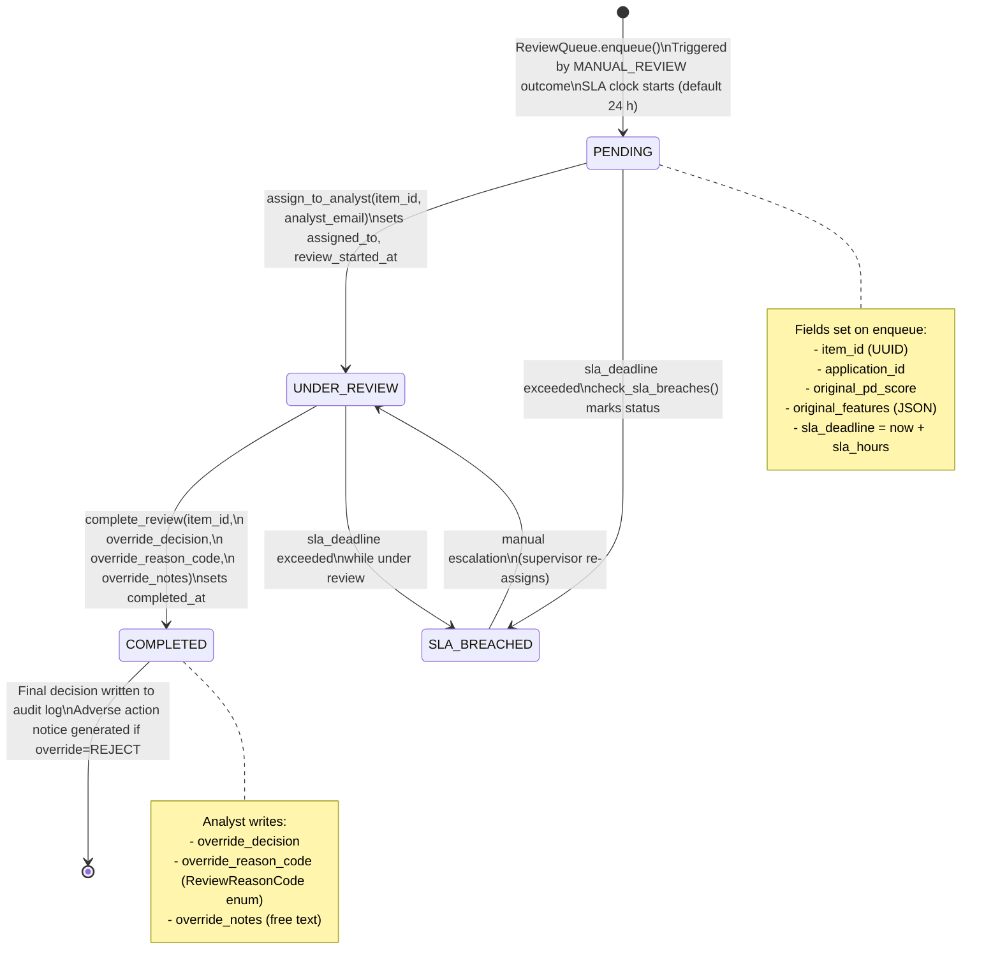

# Coding Prompt: Userflow & Decision Diagram Audit — Automatic Decisions vs. Human Review
**Platform**: `credit-risk-platform`
**Date**: 2026-04-16
**Analyst**: GitHub Copilot
**Scope**: Full codebase audit of every decision pathway, flag-for-review trigger, and the Human-In-The-Loop (HITL) lifecycle

---

## Objective

Produce a complete, machine-readable and human-readable map of every decision point in the platform where an application either receives an **automatic final decision** (`APPROVE` / `REJECT`) or is **flagged for human review** (`MANUAL_REVIEW`). The audit must:

1. Enumerate **all code paths** that emit `APPROVE`, `REJECT`, or `MANUAL_REVIEW` (and any synonyms / sub-states).
2. Document the **exact business conditions** governing each branch.
3. Render a **Mermaid flowchart** for the primary origination flow and a separate diagram for the HITL queue lifecycle.
4. Produce a **metrics module** that at runtime reports what fraction of decisions are automatic vs. routed to a human reviewer.
5. Audit the **HITL implementation** — `decisioning/review_queue.py` and `decision_engine/cc_origination_policy.py` — for completeness gaps against the PRD and surface any unmanaged edge cases.

---

## Background: What the Codebase Currently Does

### Decision Outcomes (defined in `decision_engine/engine.py`)

| Constant | Value | Meaning |
|---|---|---|
| `DECISION_APPROVE` | `"APPROVE"` | Automatic approval — no human action needed |
| `DECISION_REJECT` | `"REJECT"` | Automatic rejection — Reg B adverse action notice triggered |
| `DECISION_MANUAL_REVIEW` | `"MANUAL_REVIEW"` | Flagged — enqueued to HITL `ReviewQueue` |

### Decision Logic (inline comment, `engine.py` lines 9–13)

```
fraud_flag == "reject"         → REJECT         (AA02)
fraud_flag == "manual_review"  → MANUAL_REVIEW  (AA05)
pd_score < 0.05                → APPROVE        (standard / base rate)
0.05 ≤ pd_score ≤ 0.10        → APPROVE        (risk-priced rate)
pd_score > 0.10                → REJECT         (AA01)
```

Risk band thresholds:
- `PD_THRESHOLD_LOW = 0.05`
- `PD_THRESHOLD_MEDIUM = 0.10`

Supplemental reason codes:
- `AA03` — Insufficient credit history (open accounts < 1)
- `AA04` — DTI > 0.43
- `AA05` — Application requires manual review

### HITL Queue (`decisioning/review_queue.py`)

`ReviewQueue` is a SQLAlchemy-backed queue. Lifecycle states:

| Status | Meaning |
|---|---|
| `PENDING` | Enqueued, not yet assigned |
| `UNDER_REVIEW` | Assigned to an analyst (`assigned_to`) |
| `COMPLETED` | Analyst has submitted an `override_decision` |
| `SLA_BREACHED` | Passed `sla_deadline` (default 24 h) without completion |

Override fields written by the analyst:
- `override_decision` — analyst's final call (supersedes model output)
- `override_reason_code` — `ReviewReasonCode` enum value
- `override_notes` — free text

The CC origination policy (`decision_engine/cc_origination_policy.py`) holds a module-level `_REVIEW_QUEUE: Optional[ReviewQueue]` that is wired in via `configure_review_queue()`.

---

## Part 1 — Static Code Audit

### Step 1A — Enumerate All Decision Emission Sites

Search the entire codebase for every location that sets a final decision outcome:

```bash
# From repo root
grep -rn \
  --include="*.py" \
  -E \
  '"APPROVE"|"REJECT"|"MANUAL_REVIEW"|DECISION_APPROVE|DECISION_REJECT|DECISION_MANUAL_REVIEW' \
  . | grep -v "__pycache__" | grep -v ".pyc"
```

For each match record:

| File | Line | Decision Value | Triggering Condition (from surrounding context) | Is it final? |
|---|---|---|---|---|
| `decision_engine/engine.py` | ~236 | `MANUAL_REVIEW` | `fraud_result.fraud_flag == "manual_review"` | Yes |
| `decision_engine/engine.py` | ~372 | `MANUAL_REVIEW` | `fraud.fraud_flag == "manual_review"` (batch path) | Yes |
| `decision_engine/engine.py` | ~9 | `REJECT` (AA02) | `fraud_flag == "reject"` | Yes |
| `decision_engine/engine.py` | ~13 | `REJECT` (AA01) | `pd_score > 0.10` | Yes |
| `decision_engine/engine.py` | ~11–12 | `APPROVE` | `pd_score < 0.05` or `0.05 ≤ pd_score ≤ 0.10` | Yes |
| `decision_engine/cc_origination_policy.py` | ~102 | `MANUAL_REVIEW` | CC-specific policy gate (LGD / fraud) | Yes |
| `run_end_to_end.py` | ~238 | `manual_review` stats | Reporting only | No |

Extend this table by running the grep and completing all rows.

### Step 1B — Map Every Fraud Flag to Its Source

Trace `fraud_flag` values backward to the fraud model:

1. Find where `FraudResult(fraud_probability=..., fraud_flag=...)` is constructed.
2. Identify the threshold(s) that map `fraud_probability` → `"reject"` vs. `"manual_review"` vs. `"continue"`.
3. Document whether those thresholds are configurable (env var / config registry) or hardcoded.

Expected files to inspect:
- `models/fraud_detection/predict.py`
- `models/fraud_detection/train.py`
- `config/` or `config_registry/`

### Step 1C — Map Every Policy Override Path

Search for `policy_overrides` usage that can redirect a decision:

```bash
grep -rn --include="*.py" "policy_override\|PolicyOverride\|override_decision" . \
  | grep -v "__pycache__"
```

For each override site, answer:
- Does the override bypass the fraud gate, the PD gate, or both?
- Is a second-approver (`approved_by != submitted_by`) required before the override takes effect?
- Is the override written to `audit/override_log.py`'s `policy_overrides_log` table?

### Step 1D — Identify Any Silent / Unlogged Decision Branches

Search for returns of `APPROVE`/`REJECT`/`MANUAL_REVIEW` that are **not** followed by a call to `audit/logger.py`'s `log_decision()`:

```python
# Pattern to look for: decision emitted but audit call absent within same function body
grep -rn --include="*.py" -A 30 'DECISION_APPROVE\|DECISION_REJECT\|DECISION_MANUAL_REVIEW' . \
  | grep -B 5 -v "log_decision\|audit"
```

Flag any such sites as **GAP candidates**.

---

## Part 2 — Render Decision Flow Diagrams

### Step 2A — Primary Origination Flowchart

Create `docs/diagrams/origination_decision_flow.md` containing the following Mermaid diagram. Populate any `[???]` placeholders by reading the actual thresholds and conditions from the source files identified in Part 1.

````markdown
```mermaid
flowchart TD
    A([Application Received]) --> B[Feature Pipeline\nfeature_pipeline/]
    B --> C[Fraud Model\nmodels/fraud_detection/predict.py]
    C --> D{fraud_flag?}
    D -- '"reject"' --> E[REJECT\nAA02 — Fraud Indicators\nautomaticDecision=true]
    D -- '"manual_review"' --> F[MANUAL_REVIEW\nAA05 — Requires Human Review\nautomaticDecision=false]
    D -- '"continue"' --> G[Credit Risk Model\nmodels/credit_risk/predict.py]
    G --> H{pd_score}
    H -- "pd_score > 0.10" --> I[REJECT\nAA01 — High PD\nautomaticDecision=true]
    H -- "0.05 ≤ pd_score ≤ 0.10" --> J[APPROVE\nRisk-Priced Rate\nautomaticDecision=true]
    H -- "pd_score < 0.05" --> K[APPROVE\nBase Rate\nautomaticDecision=true]
    I --> L{Supplemental Codes?}
    L -- "DTI > 0.43" --> M[Add AA04]
    L -- "open_accounts < 1" --> N[Add AA03]
    L --> O[Reg B Adverse Action Notice\ncompliance/adverse_action_generator.py]
    F --> P[Enqueue to ReviewQueue\ndecisioning/review_queue.py]
    J --> Q[Pricing Engine\nmodels/pricing/engine.py]
    K --> Q
    Q --> R[Offer Terms Generated]
    O --> S([Decision Logged\naudit/logger.py])
    R --> S
    P --> S
```
````

Annotate each terminal node with:
- `automaticDecision: true/false`
- The FCRA adverse action codes emitted
- The downstream effect (notice sent, offer generated, queue entry created)

### Step 2B — HITL Queue Lifecycle Diagram

Create `docs/diagrams/hitl_review_queue_lifecycle.md`:

````markdown

````

### Step 2C — CC Origination Policy Diagram

Create `docs/diagrams/cc_origination_policy_flow.md` to capture the credit-card-specific policy gates in `decision_engine/cc_origination_policy.py`. Include:

- Phase 1 hard-reject gates (income, bureau score floor, prohibited variables)
- Phase 2 LGD model + HITL review queue hook (`_REVIEW_QUEUE.enqueue()`)
- Policy override bypass path
- How `configure_review_queue()` must be called before the policy is live

---

## Part 3 — Runtime Metrics Module

### Step 3A — Create `decisioning/decision_metrics.py`

This module must expose a single async function that queries the `audit_log` table and returns a breakdown of automatic vs. human-review decisions for a given tenant and time window.

```python
"""
decisioning/decision_metrics.py
================================
Runtime statistics: automatic decisions vs. HITL-flagged cases.
"""
from __future__ import annotations

from dataclasses import dataclass
from typing import Optional

from sqlalchemy.ext.asyncio import create_async_engine
from sqlalchemy import text


@dataclass
class DecisionMixReport:
    tenant_id: str
    from_date: str
    to_date: str
    total_decisions: int
    automatic_approve: int
    automatic_reject: int
    manual_review_enqueued: int
    manual_review_completed: int
    manual_review_sla_breached: int
    override_approve: int   # analyst changed MANUAL_REVIEW → APPROVE
    override_reject: int    # analyst changed MANUAL_REVIEW → REJECT
    automatic_decision_rate: float          # (approve+reject) / total
    hitl_rate: float                         # manual_review_enqueued / total
    hitl_override_reversal_rate: float       # cases where analyst changed model outcome


async def get_decision_mix(
    tenant_id: str,
    from_date: str,
    to_date: str,
    audit_db_url: str,
    review_db_url: str,
) -> DecisionMixReport:
    """
    Query audit_log + review_queue to produce DecisionMixReport.

    Parameters
    ----------
    tenant_id : str
        Tenant to scope the query.
    from_date : str
        ISO-8601 date string (inclusive lower bound).
    to_date : str
        ISO-8601 date string (inclusive upper bound).
    audit_db_url : str
        Async SQLAlchemy URL for the audit database.
    review_db_url : str
        Async SQLAlchemy URL for the review_queue database.

    Returns
    -------
    DecisionMixReport
    """
    audit_engine = create_async_engine(audit_db_url)
    review_engine = create_async_engine(review_db_url)

    # --- audit_log queries ---
    async with audit_engine.begin() as conn:
        totals = await conn.execute(
            text("""
                SELECT
                    COUNT(*)                                                 AS total,
                    SUM(CASE WHEN decision='APPROVE' THEN 1 ELSE 0 END)     AS approves,
                    SUM(CASE WHEN decision='REJECT' THEN 1 ELSE 0 END)      AS rejects,
                    SUM(CASE WHEN decision='MANUAL_REVIEW' THEN 1 ELSE 0 END) AS manual
                FROM audit_log
                WHERE tenant_id = :tid
                  AND created_at BETWEEN :fd AND :td
            """),
            {"tid": tenant_id, "fd": from_date, "td": to_date},
        )
        row = totals.fetchone()
        total = row.total or 0
        approves = row.approves or 0
        rejects = row.rejects or 0
        manual = row.manual or 0

    # --- review_queue queries ---
    async with review_engine.begin() as conn:
        rq = await conn.execute(
            text("""
                SELECT
                    COUNT(*)                                                          AS enqueued,
                    SUM(CASE WHEN status='COMPLETED' THEN 1 ELSE 0 END)              AS completed,
                    SUM(CASE WHEN status='SLA_BREACHED' THEN 1 ELSE 0 END)           AS sla_breach,
                    SUM(CASE WHEN override_decision='APPROVE' THEN 1 ELSE 0 END)     AS ov_approve,
                    SUM(CASE WHEN override_decision='REJECT' THEN 1 ELSE 0 END)      AS ov_reject
                FROM review_queue
                WHERE created_at BETWEEN :fd AND :td
            """),
            {"fd": from_date, "td": to_date},
        )
        rrow = rq.fetchone()

    enqueued    = rrow.enqueued    or 0
    completed   = rrow.completed   or 0
    sla_breach  = rrow.sla_breach  or 0
    ov_approve  = rrow.ov_approve  or 0
    ov_reject   = rrow.ov_reject   or 0

    auto_rate   = (approves + rejects) / total if total else 0.0
    hitl_rate   = manual / total               if total else 0.0
    reversal    = (ov_approve + ov_reject) / enqueued if enqueued else 0.0

    return DecisionMixReport(
        tenant_id=tenant_id,
        from_date=from_date,
        to_date=to_date,
        total_decisions=total,
        automatic_approve=approves,
        automatic_reject=rejects,
        manual_review_enqueued=enqueued,
        manual_review_completed=completed,
        manual_review_sla_breached=sla_breach,
        override_approve=ov_approve,
        override_reject=ov_reject,
        automatic_decision_rate=round(auto_rate, 4),
        hitl_rate=round(hitl_rate, 4),
        hitl_override_reversal_rate=round(reversal, 4),
    )
```

### Step 3B — Expose via API Endpoint

Add the following route to `decision-api/src/main.py`:

```python
@app.get("/v1/analytics/decision-mix", tags=["Analytics"])
async def decision_mix_report(
    tenant_id: str,
    from_date: str,
    to_date: str,
    current_user: dict = Depends(require_role(["admin", "analyst", "auditor"])),
):
    """
    Returns automatic vs. HITL decision breakdown for a tenant and date range.
    Fields: total_decisions, automatic_decision_rate, hitl_rate,
            hitl_override_reversal_rate, sla_breach count.
    """
    from decisioning.decision_metrics import get_decision_mix
    report = await get_decision_mix(
        tenant_id=tenant_id,
        from_date=from_date,
        to_date=to_date,
        audit_db_url=settings.DATABASE_URL,
        review_db_url=settings.REVIEW_QUEUE_DB_URL,
    )
    return dataclasses.asdict(report)
```

---

## Part 4 — HITL Gap Analysis

For each gap below, determine whether it is **present**, **absent**, or **partially implemented** in the current codebase. If absent or partial, add it to `docs/GAP_ANALYSIS_PRD_VS_IMPLEMENTATION.md` as a new numbered gap entry.

### Gap Checklist

| # | Control | Where to Look | Status to Determine |
|---|---|---|---|
| H-01 | `assign_to_analyst()` method exists on `ReviewQueue` | `decisioning/review_queue.py` | Present / Absent |
| H-02 | `complete_review()` requires non-null `override_reason_code` | `decisioning/review_queue.py` | Present / Absent |
| H-03 | SLA breach detection job (`check_sla_breaches()`) exists and is scheduled | `decisioning/review_queue.py`, `orchestration/` | Present / Absent |
| H-04 | Analyst assignment requires RBAC role `analyst` or `supervisor` | `compliance/rbac.py` | Present / Absent |
| H-05 | HITL override is written to `audit/override_log.py` (`policy_overrides_log`) | `decisioning/review_queue.py` or caller | Present / Absent |
| H-06 | Adverse action notice generated when analyst sets `override_decision=REJECT` | `decision-api/src/main.py` HITL completion path | Present / Absent |
| H-07 | Escalation path from `SLA_BREACHED` → supervisor re-assignment | `decisioning/review_queue.py` | Present / Absent |
| H-08 | HITL metrics (enqueued, completed, SLA breach rate) surfaced in monitoring dashboard | `monitoring/`, `analytics_api/` | Present / Absent |
| H-09 | `configure_review_queue()` is called during app startup (not left as `None`) | `decision-api/src/main.py` or `decisioning/__init__.py` | Present / Absent |
| H-10 | Second-approver check (`submitted_by != approved_by`) enforced on policy overrides | `audit/override_log.py` | Present / Absent |

### For Each Absent or Partial Gap

Generate a `GAP-HX` entry in the format used by `docs/GAP_ANALYSIS_PRD_VS_IMPLEMENTATION.md`:

```markdown
#### GAP-HX: [Control Name] — ⚠️ OPEN
**PRD Reference**: §4.x / §9.x [fill from Unified_ILOL_PRD.md]
**Severity**: P1 / P2
**Regulatory Driver**: FCRA, Reg B, OCC 2021-25 model risk guidance

**PRD Requirement**:
> "..." [quote the relevant PRD clause]

**Current State**:
- [describe what is present today]
- [describe what is missing]

**Remediation**:
1. [concrete code change]
2. [test to add]
```

---

## Part 5 — Test Coverage Audit

### Step 5A — Check Existing Tests for Decision Paths

Run the following and record which decision branches have no test coverage:

```bash
cd /Users/swarnabale/Documents/My\ Projects/credit-risk-platform
source .venv/bin/activate
python -m pytest tests/ -v --tb=short -q 2>&1 | head -80
```

Then check for coverage of the three key scenarios:
1. `fraud_flag="reject"` → `DECISION_REJECT` (AA02)
2. `fraud_flag="manual_review"` → `DECISION_MANUAL_REVIEW` (AA05) → `ReviewQueue.enqueue()` called
3. `pd_score > 0.10` with `fraud_flag="continue"` → `DECISION_REJECT` (AA01)

### Step 5B — Write Missing Tests

For each uncovered path identified in Step 5A, create a test in `tests/decisioning/test_decision_flow_coverage.py`:

```python
"""
tests/decisioning/test_decision_flow_coverage.py
==================================================
End-to-end decision path coverage validating automatic vs. HITL routing.
Each test documents the exact condition and expected outcome.
"""
import pytest
from decision_engine.engine import (
    make_decision, DecisionRequest, FraudResult, CreditResult,
    DECISION_APPROVE, DECISION_REJECT, DECISION_MANUAL_REVIEW,
)
from models.pricing.engine import PricingResult


def _make_request(fraud_flag: str, pd_score: float, **kwargs) -> DecisionRequest:
    return DecisionRequest(
        application_id="test-app-001",
        fraud_result=FraudResult(fraud_probability=0.0, fraud_flag=fraud_flag),
        credit_result=CreditResult(pd_score=pd_score, pd_band="low"),
        pricing_result=PricingResult(apr=0.05, credit_limit=5000),
        features={"dti": 0.35, "open_accounts": 3},
        **kwargs,
    )


class TestAutomaticDecisions:
    def test_fraud_reject_is_automatic(self):
        req = _make_request(fraud_flag="reject", pd_score=0.03)
        result = make_decision(req)
        assert result.decision == DECISION_REJECT
        assert "AA02" in result.reason_codes
        # Automatic — no queue entry expected
        assert result.review_queue_item_id is None  # if field exists

    def test_low_pd_approve_is_automatic(self):
        req = _make_request(fraud_flag="continue", pd_score=0.03)
        result = make_decision(req)
        assert result.decision == DECISION_APPROVE

    def test_medium_pd_approve_is_automatic(self):
        req = _make_request(fraud_flag="continue", pd_score=0.07)
        result = make_decision(req)
        assert result.decision == DECISION_APPROVE

    def test_high_pd_reject_is_automatic(self):
        req = _make_request(fraud_flag="continue", pd_score=0.15)
        result = make_decision(req)
        assert result.decision == DECISION_REJECT
        assert "AA01" in result.reason_codes


class TestHITLRouting:
    def test_fraud_manual_review_routes_to_queue(self):
        from decisioning.review_queue import ReviewQueue
        queue = ReviewQueue(db_url="sqlite+pysqlite:///:memory:")
        from decision_engine.cc_origination_policy import configure_review_queue
        configure_review_queue(queue)

        req = _make_request(fraud_flag="manual_review", pd_score=0.06)
        result = make_decision(req)
        assert result.decision == DECISION_MANUAL_REVIEW
        assert "AA05" in result.reason_codes

        pending = queue.get_pending()
        assert len(pending) == 1
        assert pending[0].application_id == req.application_id

    def test_sla_breach_detected(self):
        from decisioning.review_queue import ReviewQueue
        import time
        queue = ReviewQueue(db_url="sqlite+pysqlite:///:memory:")
        item = queue.enqueue("app-sla", pd_score=0.08, features={}, sla_hours=0)
        time.sleep(0.01)
        queue.check_sla_breaches()
        breached = queue.get_by_status("SLA_BREACHED")
        assert any(i.item_id == item.item_id for i in breached)
```

---

## Part 6 — Documentation Deliverables

After completing Parts 1–5, produce or update the following files:

| File | Content |
|---|---|
| `docs/diagrams/origination_decision_flow.md` | Mermaid flowchart (Step 2A) |
| `docs/diagrams/hitl_review_queue_lifecycle.md` | State diagram (Step 2B) |
| `docs/diagrams/cc_origination_policy_flow.md` | CC-specific flowchart (Step 2C) |
| `docs/DECISION_ROUTING_SUMMARY.md` | Prose summary: % automatic vs. HITL, fraud thresholds, PD thresholds, HITL controls present/absent |
| `decisioning/decision_metrics.py` | Runtime metrics module (Step 3A) |
| `tests/decisioning/test_decision_flow_coverage.py` | Decision path tests (Step 5B) |
| `docs/GAP_ANALYSIS_PRD_VS_IMPLEMENTATION.md` | Updated with any new GAP-HX entries (Part 4) |

---

## Acceptance Criteria

- [ ] Mermaid origination flowchart covers **every** terminal decision node found in Part 1 — no undocumented branches.
- [ ] Every `MANUAL_REVIEW` emission site is traced to a `ReviewQueue.enqueue()` call or is flagged as GAP-H09.
- [ ] `DecisionMixReport` compiles and the `/v1/analytics/decision-mix` endpoint returns HTTP 200 with correct field names.
- [ ] All H-01 through H-10 checks are answered with Present / Absent / Partial and any absent items have a GAP-HX entry.
- [ ] `pytest tests/decisioning/test_decision_flow_coverage.py -v` passes with 0 failures.
- [ ] Fraud threshold values (`"reject"` vs `"manual_review"` boundary) are documented in `docs/DECISION_ROUTING_SUMMARY.md` with the exact source file + line number.
