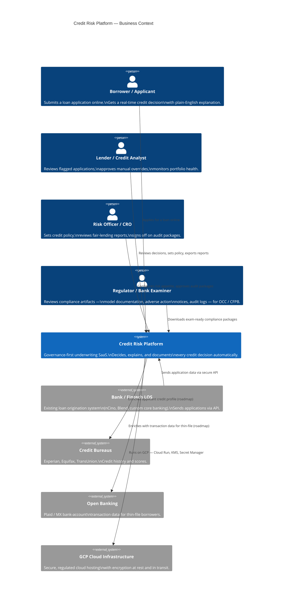
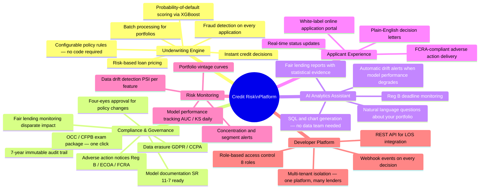
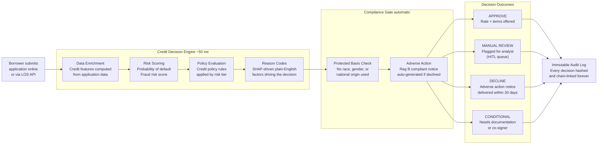
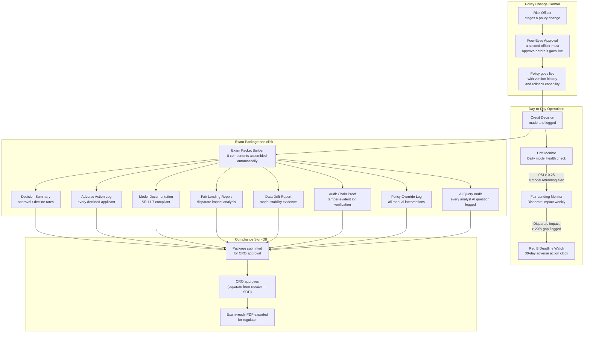
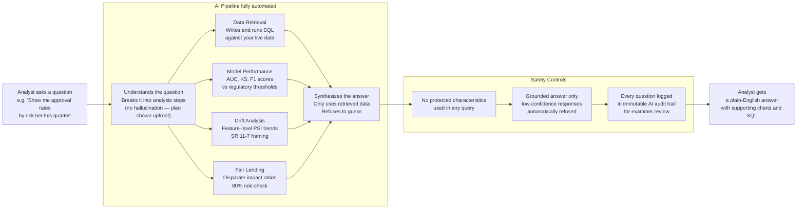
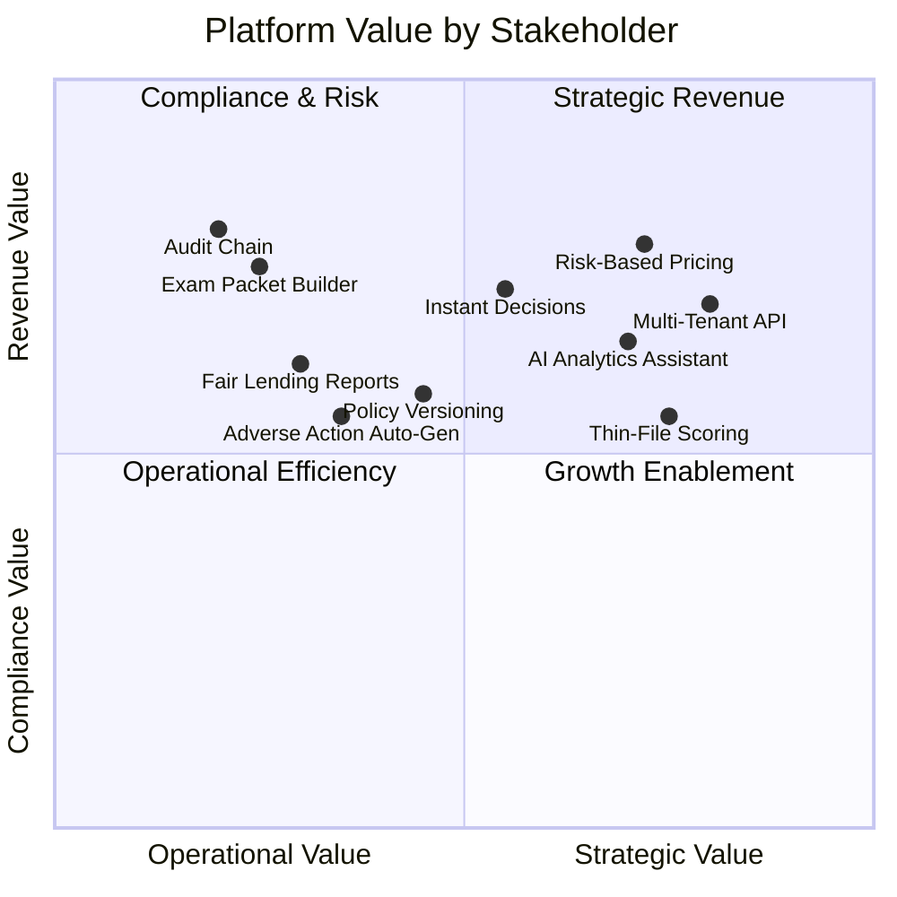
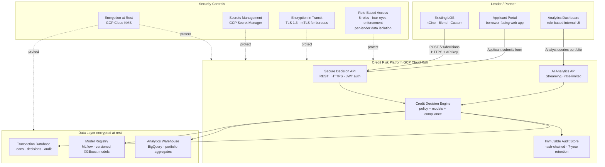

# Credit Risk Platform — Business Architecture

> Audience: Business stakeholders, investors, product leaders, bank/fintech partners
> Version: 1.5.0 | April 2026

---

## 1. Who Uses the Platform and Why

---

## 2. Platform Capability Map

---

## 3. How a Loan Decision Works (End-to-End)

---

## 4. Compliance & Audit Lifecycle

---

## 5. AI Analytics Assistant — How It Works

---

## 6. Stakeholder Value Summary

---

## 7. Deployment Model

---

## 8. Regulatory Alignment at a Glance

| Regulation | Requirement | How the Platform Addresses It |
|---|---|---|
| **Reg B (ECOA)** | Adverse action notice within 30 days | Auto-generated at decision time, deadline tracked, delivered via portal |
| **FCRA** | Accurate adverse action reason codes | SHAP-driven codes, 5-factor model, compliant notice format |
| **Fair Housing Act** | No disparate impact on protected classes | Weekly DIR / BISG analysis, 80% rule monitoring, examiner report |
| **SR 11-7** | Model risk management documentation | Auto-generated model card, validation evidence, exam packet component |
| **GDPR / CCPA** | Right to erasure, data minimization | Erasure request workflow, PII masking in audit logs |
| **SOX / Internal Audit** | Change control, four-eyes approval | Policy versioning + two-officer approval gate, full override log |
| **OCC / CFPB Examination** | Exam-ready documentation package | One-click 8-component exam packet, PDF export, chain-of-custody proof |
