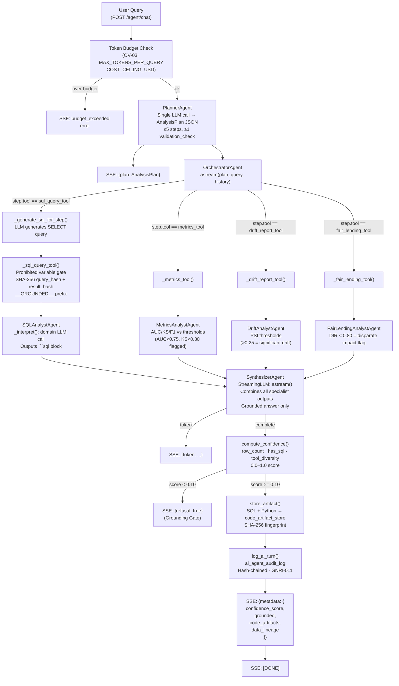
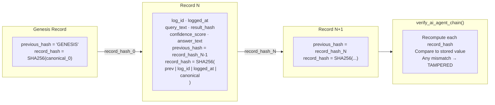
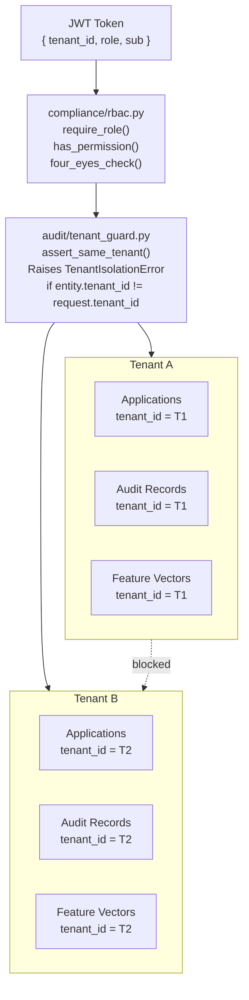
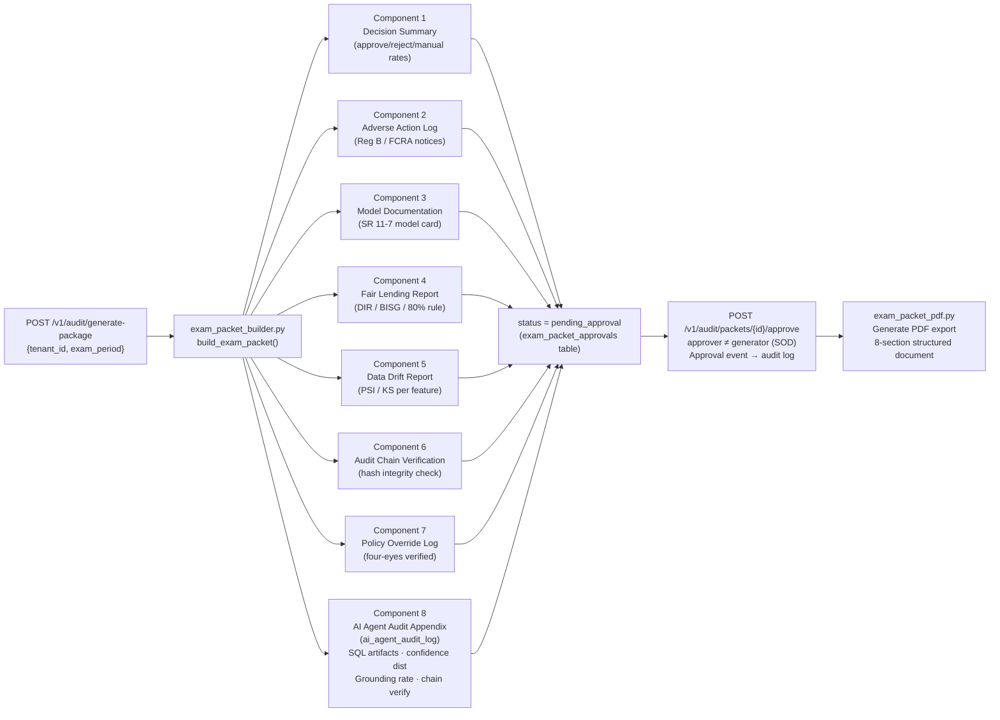
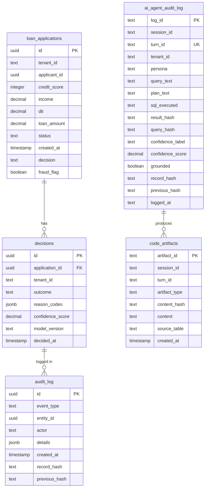

# Credit Risk Platform — Detailed Implementation Architecture

> Generated: 2026-04-25
> Branch: v1.5.0
> All GAPs 01–23 closed + OV-01 through OV-04 closed.

---

## 1. Full Service Topology (Docker Compose)

```mermaid
graph TB
    subgraph BROWSER["Browser / External Clients"]
        AP_UI["Applicant Portal\nlocalhost:3000\nNext.js 14"]
        AD_UI["Analytics Dashboard\nlocalhost:3001\nNext.js 14"]
        LOS_EXT["LOS / Partner API\n(external REST client)"]
    end

    subgraph APIS["FastAPI Services"]
        IAPI["ingestion-api\n:8080\n/v1/ingest/transactions\n/v1/ingest/applications"]
        DAPI["decision-api\n:8081\n/v1/decisions\n/v1/decisions/batch\n/v1/config/*\n/v1/audit/*\n/v1/review/*\n/v1/portal/*"]
        AAPI["ai-agent\n:8082\n/agent/sessions\n/agent/chat (SSE)\n/agent/sessions/{id}/history"]
        SCHED["ai-agent-scheduler\nsidecar\nscheduler.py"]
    end

    subgraph MIDDLEWARE["Middleware Stack (decision-api)"]
        RL_MW["RateLimitMiddleware\n(middleware/rate_limit.py)\nRedis token-bucket · per (tenant,route)"]
        IDP_MW["IdempotencyMiddleware\n(middleware/idempotency.py)\nRedis · 24h TTL · per (tenant, key)"]
        OTEL["OpenTelemetry Instrumentation\n(observability/tracing.py)"]
    end

    subgraph DOMAIN["Domain Packages"]
        DE["decision_engine/\nengine.py · policy_dsl.py\npolicy_version_store.py\npolicy_challenger.py"]
        FP["feature_pipeline/\nfeatures.py · feature_store.py\nlineage.py (OpenLineage)"]
        MOD["models/\ncredit_risk/predict.py (XGBoost)\nfraud_detection/predict.py (IsoForest)\npricing/engine.py\nmodel_loader.py (cached)"]
    end

    subgraph COMPLIANCE["Compliance Domain"]
        RBAC["compliance/rbac.py\n8 roles · 4-eyes SOD\ncro · compliance_officer\nauditor · legal_counsel\nml_developer · ml_validator\ndata_engineer · system_service_acct"]
        COMPENG["compliance/engine.py\nFair lending rule checks\nECOA / FHA / TRID / state usury"]
        PROHIB["compliance/prohibited_variables.py\nprotected-basis column gate\n(gender, race, national_origin…)"]
        AA_GEN["compliance/adverse_action_generator.py\nReg B reason codes\nAA01–AA05 · FCRA"]
        AA_STORE["compliance/adverse_action_store.py\n30-day Reg B deadline tracking"]
        EP_BUILD["compliance/exam_packet_builder.py\n8 components · OCC/CFPB ready\nbuild_ai_agent_audit_component()"]
        EP_APPR["compliance/exam_packet_approval_store.py\npending_approval→approved|rejected\nSOD enforced"]
        RET["compliance/retention_policy.py\nRETENTION_SCHEDULE\n7-year window for ai_agent_audit_log"]
    end

    subgraph AUDIT["Audit Domain"]
        ALOGG["audit/logger.py\nlog_decision() async\nSHA-256 hash-chain\nPII masking (SSN hash, acct last-4)"]
        CVERIF["audit/chain_verifier.py\nverify_chain()\nverify_ai_agent_chain()"]
        OVRLOG["audit/override_log.py\nlog_override()\npolicy_overrides_log table"]
        TGUARD["audit/tenant_guard.py\nassert_same_tenant()\nprevents cross-tenant leakage"]
        CONSIST["audit/consistency_scorer.py\nfairness across similar applicants"]
    end

    subgraph AI_AGENT["AI Agent Pipeline (GAP-19)"]
        direction TB
        PLAN["planner_agent.py\nPlannerAgent\nStage 1: structured AnalysisPlan\n≤5 steps · intent · validation_checks"]
        ORC_AG["specialist_agents.py\nOrchestratorAgent\nStage 2-A: dispatch to specialists"]
        SQL_SP["SQLAnalystAgent\ngenerate SQL → execute → interpret"]
        MET_SP["MetricsAnalystAgent\nAUC/KS/F1 interpretation"]
        DRIFT_SP["DriftAnalystAgent\nPSI/KS · SR 11-7 context"]
        FL_SP["FairLendingAnalystAgent\nDIR/BISG · 80% rule"]
        CHART_SP["ChartGeneratorAgent\nRecharts spec generation"]
        REP_SP["ReportGeneratorAgent\nMarkdown audit-ready reports"]
        SYNTH["SynthesizerAgent\nStage 2-B: ground + combine\nfinal answer + python artifacts"]
        CONF["confidence_scorer.py\nCompute 0–1 score\nGrounding gate (refusal < 0.10)"]
        ART["code_artifact_store.py\nSQL + Python artifact persistence\nSHA-256 fingerprint"]
        AI_AUD["ai_audit_log.py (GNRI-011)\nAppend-only hash-chained\nlog_ai_turn() · 7-year retention"]
    end

    subgraph MONITORING["Monitoring & Observability"]
        DRIFT_M["monitoring/drift_monitor.py\nPSI + KS test · per feature"]
        FL_M["monitoring/fair_lending.py\nDIR · BISG disparate impact"]
        SLA_M["monitoring/referral_sla_monitor.py\nReg B 30-day SLA breach"]
        ALERT["monitoring/alert_router.py\nEmail/Slack · SMTP TLS"]
        CC_MON["monitoring/cc_portfolio_monitor.py\nCC pd monitor · cc valuation"]
    end

    subgraph DATA_STORES["Data Stores"]
        PG1[("PostgreSQL :5432\nLoans DB\nloan_applications · decisions\naudits · agent_sessions")]
        PG2[("PostgreSQL :5433\nTransactions DB\nbank_accounts · payments · fraud")]
        PG3[("PostgreSQL :5434\nCredit Cards DB\ncard_accounts · statements")]
        REDIS_DB[("Redis :6379\nRate-limit counters\nIdempotency cache\nSession state")]
        BQDB[("Google BigQuery\nAnalytics Warehouse\ndecisions · audit_logs · features")]
        MLFLOW_DB[("MLflow :5000\nModel Registry\nExperiment tracking\nArtifact versioning")]
    end

    subgraph ETL["ETL & Data Quality"]
        PUBSUB_ETL["etl/pubsub_consumer.py\nGoogle Pub/Sub subscriber\nexponential backoff retry ×3"]
        DQ["data_quality/expectations.py\nGreat Expectations validation"]
        LIN["feature_pipeline/lineage.py\nOpenLineage / Marquez"]
        DC["data_contracts/registry.py\nContract versioning\ndata_contracts/v1/"]
    end

    subgraph INFRA_GCP["GCP Infrastructure"]
        CR["Cloud Run\ndecision-api · ai-agent\ningestion-api · portals"]
        SM["Secret Manager\nJWT_SECRET · API keys"]
        KMS["Cloud KMS\nEncryption at rest"]
        GCS_B["Cloud Storage\nRaw ingestion payloads\nModel artifacts"]
        VA["Vertex AI\nFeature Store · Pipelines"]
    end

    %% External → API
    AP_UI -->|"REST"| DAPI
    AD_UI -->|"REST + SSE"| DAPI
    AD_UI -->|"REST + SSE"| AAPI
    LOS_EXT -->|"POST /v1/decisions"| DAPI
    LOS_EXT -->|"POST /v1/ingest/*"| IAPI

    %% Middleware chain
    DAPI --> RL_MW --> IDP_MW --> OTEL

    %% Decision-API → Domain
    DAPI --> RBAC
    DAPI --> DE
    DAPI --> FP
    DAPI --> MOD
    DAPI --> PROHIB
    DAPI --> ALOGG
    DAPI --> AA_GEN
    DAPI --> AA_STORE
    DAPI --> EP_BUILD
    DAPI --> EP_APPR
    DAPI --> OVRLOG

    %% AI Agent pipeline
    AAPI --> PLAN
    PLAN --> ORC_AG
    ORC_AG --> SQL_SP
    ORC_AG --> MET_SP
    ORC_AG --> DRIFT_SP
    ORC_AG --> FL_SP
    ORC_AG --> CHART_SP
    ORC_AG --> REP_SP
    ORC_AG --> SYNTH
    SYNTH --> CONF
    CONF --> ART
    ART --> AI_AUD
    AAPI --> AI_AUD
    SQL_SP --> PROHIB

    %% Ingestion → Pub/Sub
    IAPI --> PUBSUB_ETL
    PUBSUB_ETL --> PG1
    IAPI --> DQ

    %% Data flows
    ALOGG --> PG1
    AI_AUD --> PG1
    FP --> PG1
    CVERIF --> PG1
    OVRLOG --> PG1
    AA_STORE --> PG1
    EP_APPR --> PG1
    REDIS_DB --> RL_MW
    REDIS_DB --> IDP_MW

    %% BigQuery
    DAPI --> BQDB
    AAPI --> BQDB

    %% MLflow
    MOD --> MLFLOW_DB

    %% Monitoring
    DRIFT_M --> ALERT
    FL_M --> ALERT
    SLA_M --> ALERT
    SCHED --> DRIFT_M
    SCHED --> SLA_M

    %% GCP
    IAPI --> GCS_B
    SM --> DAPI
    SM --> AAPI
    KMS --> PG1
```



---

## 2. Decision API — Route Map

```mermaid
mindmap
  root((Decision API\n:8081))
    Decisioning
      POST /v1/decisions
      POST /v1/decisions/batch
      GET  /v1/batch/status/{id}
      GET  /v1/batch/results/{id}
    Config & Policy
      GET/PUT /v1/config/policy
      POST /v1/config/policy/stage
      POST /v1/config/policy/approve
      GET  /v1/config/policy/versions
      GET  /v1/config/policy/versions/{v}
      POST /v1/config/policy/rollback
      POST /v1/config/policy/challenge
    Audit & Compliance
      POST /v1/audit/generate-package
      POST /v1/audit/packets/{id}/approve
      POST /v1/audit/packets/{id}/reject
      GET  /v1/audit/packets/{id}
      GET  /v1/audit/packets/pending
      GET  /v1/audit/chain/verify
      GET  /v1/audit/replay/{id}
    Review Queue
      GET  /v1/review/queue
      POST /v1/review/{id}/claim
      POST /v1/decisions/{id}/override
    Adverse Action
      GET  /v1/adverse-action/pending
      GET  /v1/adverse-action/{id}
      GET  /v1/adverse-action/
      POST /v1/adverse-action/{id}/mark-delivered
    Erasure
      POST /v1/erasure/request
      GET  /v1/erasure/requests
    Portal
      POST /v1/portal/apply
      GET  /v1/portal/status/{id}
    Health
      GET  /v1/health
      GET  /v1/health/dependencies
      GET  /v1/metrics
```

---

## 3. AI Agent — Specialist Dispatch Logic



---

## 4. Immutable Audit Chain — Hash Algorithm



---

## 5. Multi-Tenant Isolation Model



---

## 6. Compliance Exam Packet — 8 Components



---

## 7. Data Store Schema Summary



---

## 8. Port Reference

| Service | Port | Protocol | Purpose |
|---|---|---|---|
| `ingestion-api` | 8080 | REST | Data ingest, Pub/Sub publish |
| `decision-api` | 8081 | REST | Underwriting, audit, compliance |
| `ai-agent` | 8082 | REST + SSE | Multi-agent AI query pipeline |
| `applicant-portal` | 3000 | HTTP | Loan application UI (Next.js) |
| `analytics-dashboard` | 3001 | HTTP | Internal analytics UI (Next.js) |
| `dashboard` | 8501 | HTTP | Streamlit portfolio dashboard (legacy) |
| `mlflow` | 5000 | HTTP | ML experiment tracking |
| `postgres` (Loans) | 5432 | TCP | Primary OLTP — decisions, audit |
| `postgres-transactions` | 5433 | TCP | Transactions domain |
| `postgres-cards` | 5434 | TCP | Credit cards domain |
| `redis` | 6379 | TCP | Rate limiting, idempotency cache |

---

## 9. Key Security Controls

```mermaid
mindmap
  root((Security Controls))
    Identity & Access
      JWT_SECRET mandatory non-empty at boot
      8-role RBAC (compliance/rbac.py)
      Four-eyes enforcement (SOD)
      Per-tenant isolation (tenant_guard.py)
    Data Protection
      PII masking in audit_log (SSN hash, acct last-4)
      TLS 1.2+ / 1.3 on all connections
      mTLS for credit bureau clients
      Cloud KMS encryption at rest
      Secret Manager for credentials
    API Security
      Redis token-bucket rate limiting per (tenant, route)
      Idempotency middleware prevents duplicate audit entries
      Prohibited variable gate (ECOA/FHA protected bases)
      SQL injection prevention (SELECT-only gate + parameterized queries)
      OpenAI API key startup assertion (OV-03)
    Supply Chain
      gitleaks (.gitleaks.toml) — secrets scanning
      No eval() in policy path (Policy DSL replaces decision_engine_agent)
    Audit & Compliance
      Immutable append-only audit log (SHA-256 hash chain)
      AI agent audit log (GNRI-011, 7-year retention)
      Exam packet HITL approval gate
      Reg B 30-day adverse action deadline monitoring
      OCC/CFPB exam packet — 8 components, PDF export
```
