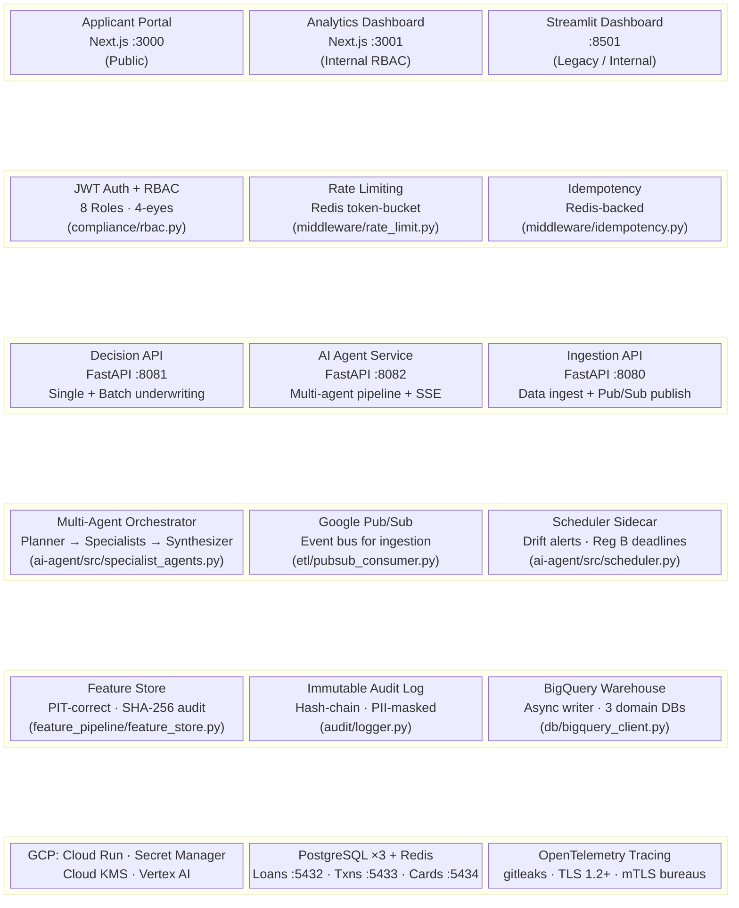
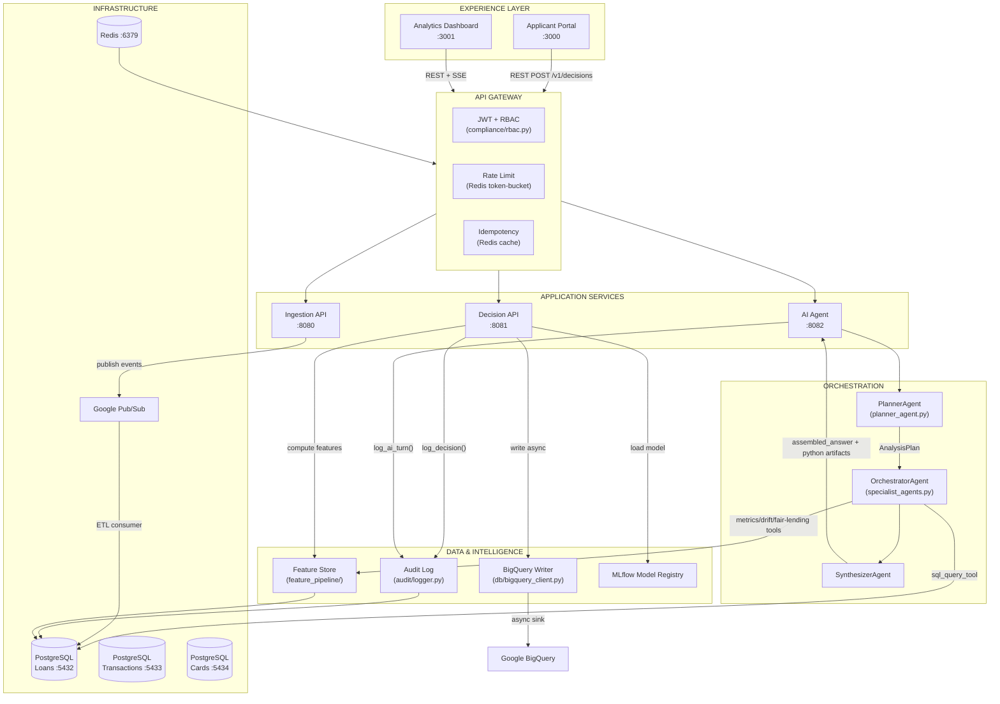
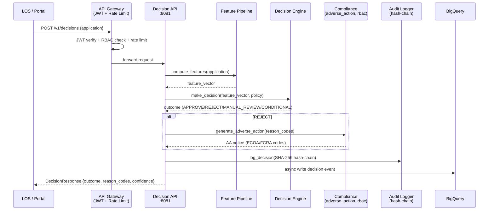
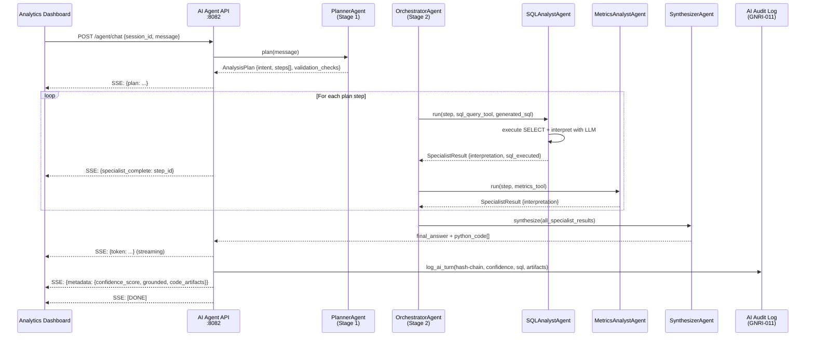
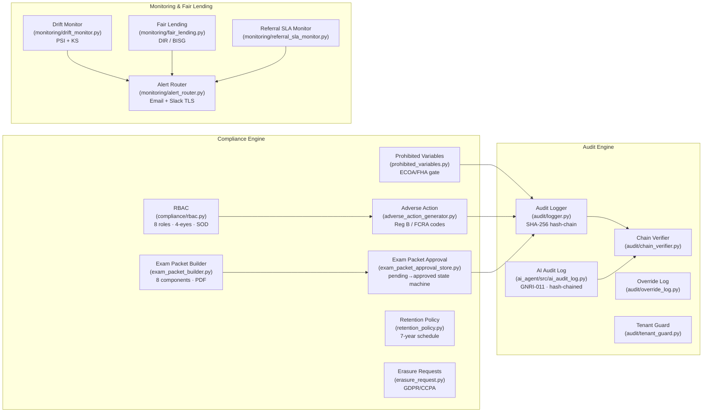

# Credit Risk Platform — High-Level Layered Architecture

> Generated: 2026-04-25
> Branch: v1.5.0
> Status: Reflects implemented state as of GAP-19 closure.

---

## 6-Layer Stack

---

## Layer-to-Layer Data Flow

---

## Decision Path (Single Application)

---

## AI Agent Multi-Agent Pipeline

---

## Compliance & Governance Subsystem

