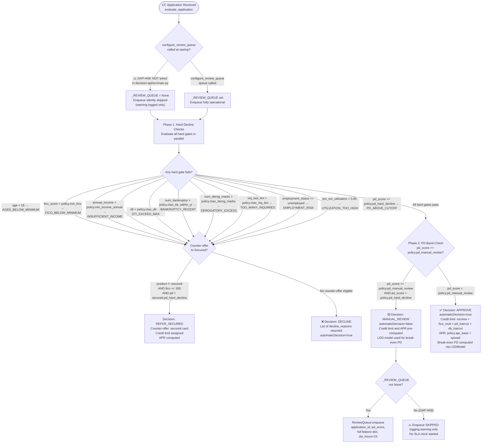

# CC Origination Policy Decision Flow
**Source**: `decision_engine/cc_origination_policy.py`
**Generated**: 2026-04-16 by GitHub Copilot

## CC Product Policy Gate Flowchart



## Product Policy Thresholds (Source: `cc_origination_policy.py` lines 152–213)

| Product | min_fico | max_dti | min_income | pd_hard_decline | pd_manual_review |
|---|---|---|---|---|---|
| secured | 300 | 0.65 | $8,000 | 0.55 | 0.40 |
| student | 600 | 0.50 | $10,000 | 0.30 | 0.18 |
| basic | 620 | 0.50 | $18,000 | 0.25 | 0.14 |
| rewards | 670 | 0.45 | $30,000 | 0.18 | 0.10 |
| premium | 720 | 0.40 | $60,000 | 0.12 | 0.07 |
| ultra_premium | 760 | 0.35 | $150,000 | 0.06 | 0.04 |
| business | 650 | 0.50 | $40,000 | 0.22 | 0.12 |

## configure_review_queue() Wiring Note

The module-level `_REVIEW_QUEUE: Optional[ReviewQueue]` is set via:
```python
# decision_engine/cc_origination_policy.py lines 70–73
_REVIEW_QUEUE: Optional["ReviewQueue"] = None

def configure_review_queue(queue: "ReviewQueue") -> None:
    global _REVIEW_QUEUE
    _REVIEW_QUEUE = queue
```

**⚠️ GAP-H09**: `configure_review_queue()` is **not called** in `decision-api/src/main.py` startup. The queue is `None` in production, meaning all MANUAL_REVIEW outcomes from the CC origination policy silently skip the enqueue step (with only a `logging.warning`).

## Policy Override Bypass Path

`make_decision()` in `engine.py` supports `policy_overrides` dict — overrides `pd_threshold_low`, `pd_threshold`, `dti_high`.
Four-eyes sign-off required: `submitted_by != approved_by`, min 10-char justification.
Override records written to `audit/override_log.py` `policy_overrides_log` table via `PolicyOverrideRecord`.
