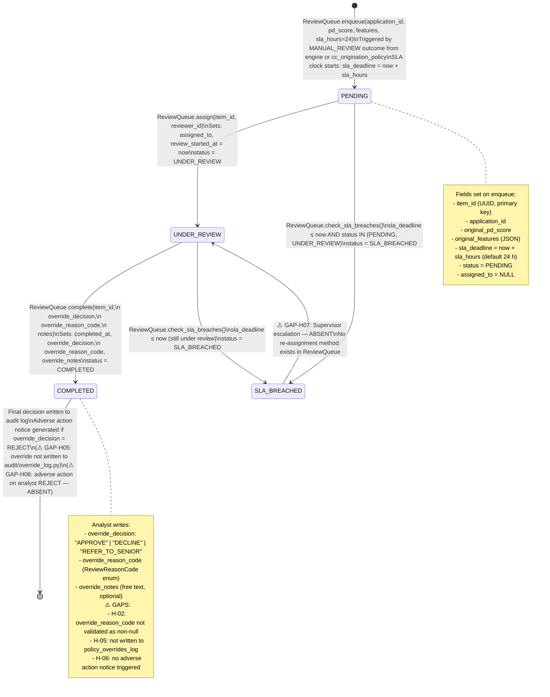

# HITL Review Queue Lifecycle
**Source**: `decisioning/review_queue.py`
**Generated**: 2026-04-16 by GitHub Copilot

## State Diagram



## ReviewReasonCode Enum Values

| Value | Meaning |
|---|---|
| `INSUFFICIENT_INCOME` | Income below threshold |
| `THIN_FILE` | Insufficient credit history |
| `FRAUD_INDICATORS` | Elevated fraud signals |
| `POLICY_EXCEPTION` | Business policy exception |
| `INCORRECT_MODEL_INPUT` | Data quality / input error |
| `DATA_QUALITY_CONCERN` | Upstream data issue |
| `MANUAL_ESCALATION` | Supervisor requested review |
| `OTHER` | Catch-all |

## Override Decision Allowed Values

Method: `ReviewQueue.complete()` line 184

```python
allowed = {"APPROVE", "DECLINE", "REFER_TO_SENIOR"}
```

**Note**: The override decision values (`DECLINE`, `REFER_TO_SENIOR`) differ from the engine's canonical values (`REJECT`, `MANUAL_REVIEW`). This mapping gap may cause downstream issues when writing to the audit log. ⚠️ GAP-H05.
