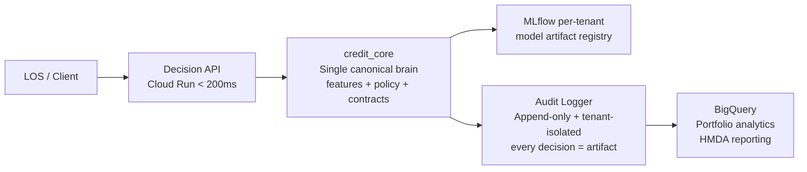

# Investor Pitch Deck
## Credit Risk Platform — Seed Round

> Version: 1.0 | Date: 2026-04-07 | Status: DRAFT
> Round: Seed | Raising: $3.5M
> Audience: Seed & Pre-Series A venture capital partners
> Cross-references: `docs/BUSINESS_ASSETS_2026.md`, `docs/go_to_market/GTM_STRATEGY.md`, `docs/go_to_market/IDEAL_CUSTOMER_PROFILE.md`

---

## SLIDE 1 — Cover

### Credit Risk Platform
**The Governance-First Credit Risk Control Tower**

> Every risk decision — traceable.
> Every model outcome — auditable.
> Every portfolio insight — actionable.
> Out of the box. In under 30 days.

**Seed Round | Raising $3.5M**

Contact: [Founder Name] | [email@creditriskplatform.io] | creditriskplatform.io

---

## SLIDE 2 — The Problem

### Mid-Market Lenders Are Facing a Compliance Storm — With Stone Age Tools

**The regulatory burden has exploded 340% since 2010 (Accenture). The tooling hasn't caught up.**

**Regulatory pressure at a historic high:**
- **Basel IV IRB model governance** (effective EU Jan 2025; US banks watching and preparing)
- **SR 11-7 / OCC Model Risk Guidance** — requires documented model validation, lineage, and outcomes monitoring. Most mid-market institutions are non-compliant at scale.
- **CFPB Reg B adverse action** — explainability on automated decisioning is now mandatory. "The model said no" is not a legal adverse action reason.
- **CECL / IFRS 9** — forward-looking expected credit loss reserves require continuous portfolio-level modeling. Not a spreadsheet in Finance. Not a point-in-time snapshot.

**The business cost — quantified:**

| Pain | Cost |
|---|---|
| Average OCC model risk finding | **$2–15M** per remediation |
| Manual audit prep for one credit model | **6–10 weeks** of analyst time per exam cycle |
| Approval rate leakage from opaque decisioning | **3–8% of eligible applicants** rejected incorrectly |
| Credit losses from policy drift and poor segmentation | **$800M+ / year** industry-wide for mid-tier lenders |

**The operational reality:**
- Risk analytics live in Excel, SAS, and Tableau — disconnected from the actual decision engine
- Model governance happens in SharePoint threads and email attachments
- Audit evidence is assembled in a panic 3 weeks before an exam
- P&L attribution by risk cohort requires 2–3 weeks of custom data wrangling

**Timeline: The Compliance Burden Explosion (2010–2026)**
```
2010 ────────── Dodd-Frank ──── CFPB created ─────── SR 11-7 ─── CECL ─── Basel IV ─── 2026
     +0%                                                                              +340% burden
```

**"The tooling hasn't caught up. We're changing that."**

---

## SLIDE 3 — Current Solutions and Why They Fail

| Approach | What They Do | Time to Value | Avg Cost | Governance Coverage | Verdict |
|---|---|---|---|---|---|
| **Legacy SAS / FICO / Moody's** | Model development, batch scoring | 12–18 months | $2M–$5M+ | High (but manual) | Too slow, too expensive for mid-market |
| **Internal BI build (Tableau / Power BI / dbt)** | Dashboards and data pipelines | 6–12 months | $500K–$2M/yr in engineering | Zero — no audit trail, no domain logic | Requires 12 months of internal engineering, then fails at exam |
| **Point solutions (ModelRisk, Validatas)** | Model validation only | 3–6 months | $80K–$300K | Narrow — one workflow | Solves one problem; doesn't connect to originations or portfolio |
| **LOS platforms (nCino, CloudBankin)** | Loan origination workflow | 6–12 months | $200K–$600K | Black box — no explainability | No post-origination analytics; decisions are unexplainable |
| **Internal build ("we'll do it ourselves")** | Custom-built platform | 12–18 months | $1–3M in engineering | Aspirational but never complete | No commercial roadmap; key-person risk; fails at audit |

**The gap no one has filled:**
No single platform connects **originations → portfolio → P&L → compliance → governance documentation** in one governed workflow — for the 2,800 mid-market lenders who can't afford Moody's and can't build it themselves.

**"No one has built a governed, full-stack layer for the mid-market. We did."**

---

## SLIDE 4 — Our Solution

### Credit Risk Platform: The Governance-First Credit Risk Control Tower

**Core positioning:**
Plug in your lending data → get a fully operational risk analytics + governance platform in **under 30 days**.

**Six integrated modules:**

| Module | What It Delivers |
|---|---|
| **Originations Intelligence** | Approval/denial flow, risk-tier segmentation, scorecard performance, vintage view |
| **Portfolio Analytics** | Delinquency roll rates, vintage curves, cohort loss projections, concentration risk |
| **P&L & Profitability Engine** | Risk-adjusted return by segment, LTV/IRR/NPV, cost of credit vs yield |
| **Valuation & Stress Testing** | CECL/IFRS 9 reserve modeling, rate shock scenarios, loss curve projections |
| **Policy & Strategy Workbench** | Version-controlled credit policy, A/B champion/challenger management |
| **Governance & Audit Layer** | Automated SR 11-7 model docs, decision lineage, one-click audit export, CFPB Reg B reason codes |

**Key architecture advantages:**
- **Every action = a governance artifact**: every decision in the platform creates a timestamped audit record (`audit/logger.py`)
- **SHAP explainability built-in**: every credit decision includes Reg B-compliant reason codes (`agents/explainability_agent.py`)
- **Decision API < 200ms p99**: GCP Cloud Run deployment with preloaded model artifacts
- **Multi-tenant SaaS**: GCP-native, tenant-isolated architecture (P0.1 completion in 2 weeks)
- **Safe policy DSL**: AST-validated rule evaluation — no `eval()`, no code injection risk (`decision_engine/policy_dsl.py`)

---

## SLIDE 5 — Product Walkthrough

### 30-Day Onboarding Trajectory

```
Week 1–2: Data Connect
───────────────────────
• Decision API credentials provisioned
• LOS API integration configured
• First live decision call with customer data

Week 2–3: Platform Activation
────────────────────────────────
• Originations dashboard populated
• Portfolio Analytics connected to warehouse
• Model monitoring reports initialized

Week 3–4: Governance Live
──────────────────────────
• First audit package generated
• Model documentation auto-created (SR 11-7 template)
• Champion/challenger framework configured
```

### The Day-30 Demo Narrative

> *"At Day 30 with a $400M AUM credit union in Ohio, their CRO ran our pre-exam diagnostic and exported 47 governance artifacts — model cards, policy version history, decision lineage, fairness assessments. That package would have taken her team 8 weeks to assemble manually. She signed the annual contract the same afternoon."*

**Screenshot placeholders:**
- `[Decision API response: DECLINE, reason codes R01/R03, SHAP breakdown]`
- `[Governance audit export: 47 artifacts, SR 11-7 checklist, 100% complete]`
- `[Portfolio Analytics: vintage curve with cohort loss projection overlaid]`

---

## SLIDE 6 — Technical Moat

### Why This Is Hard to Copy in 18 Months



**Five technical moats that compound:**

1. **Governance-by-default architecture** — every agent action creates an append-only, timestamped audit event. Governance is not a module you bolt on. It is the infrastructure. (`audit/logger.py`)

2. **Tenant isolation from the ground up** — JWT `tenant_id` claim enforces complete data separation at the storage, query, and API layer. Zero cross-tenant leakage. (P0.1 implementation plan)

3. **Safe policy DSL** — credit policy rules are evaluated by an AST-validated expression parser, not Python `eval()`. Rules are traceable, deterministic, and auditable. (`decision_engine/policy_dsl.py`)

4. **Deterministic replay (roadmap P3.1)** — policy hash + model artifact hash + point-in-time feature snapshot → regulators can replay any historical decision. This is not available from any competitor in the mid-market.

5. **Patent-pending: Automated governance artifact generation** — the platform generates SR 11-7 model documentation automatically from runtime training and decision events. No analyst fills out a Word template. (`compliance/generate_model_doc.py`)

---

## SLIDE 7 — Market Size

### Attacking the $2.1B Governance + Analytics Gap in Mid-Market Lending

| Market Layer | Size | Source |
|---|---|---|
| **TAM** — Global credit risk technology | $18.4B (2025) → $35B by 2030 (14% CAGR) | IDC 2025 Financial Services Technology Forecast |
| **SAM** — US mid-market lenders ($100M–$15B AUM) | $2.1B (2,800 institutions × avg $80K–$500K platform budget/yr) | FDIC Call Reports + CFPB supervised entity list |
| **SOM** — Year 5 attainable | $22M ARR (120 customers @ avg $180K ARR) | Company projection |

**The wedge logic:**
We are not competing with Moody's $5M enterprise contracts for Tier 1 banks. We are capturing the **$2–3B governance-analytics gap** that legacy platforms leave behind in the 2,800 mid-market institutions they don't serve.

**Regulatory tailwind timeline:**
```
2024: Basel IV adopted in EU → US banks begin preparing frameworks
2025: CFPB signals increased Reg B enforcement on automated AI decisions
2026: CECL deadline for remaining institutions (SEC filers already compliant)
2026: OCC intensifying model risk examination focus on AI/ML models
```
This is not a secular trend. It is a regulatory mandate creating **immediate urgency** in every sales conversation.

---

## SLIDE 8 — Business Model

### Capital-Efficient SaaS + Usage + Services

**Revenue mix at Year 3 target**: SaaS 65% | Usage 20% | Professional Services 15%

**Pricing tiers** (see `docs/go_to_market/GTM_STRATEGY.md` Section 6):

| Tier | ARR | Module Scope |
|---|---|---|
| Starter | $60K | Decision API + Governance Layer |
| Growth | $150K | + Portfolio Analytics + Originations Intelligence |
| Enterprise | $300K–$600K | Full platform + custom integrations + dedicated CSM |
| Platform API | $0.05 / decision | White-label for LOS vendors |

**Unit Economics:**

| Metric | Target |
|---|---|
| Customer Acquisition Cost (CAC) | $35K–$55K |
| Average Contract Value (ACV) | $130K Year 1 → $200K Year 3 (module expansion) |
| Lifetime Value (LTV) | $420K (3.5-year avg duration × $120K avg ARR) |
| LTV / CAC ratio | **7–10×** |
| Gross Margin | 72% Year 1 → 80% Year 4 |
| Payback Period | 14–18 months |
| Net Revenue Retention | **115%+** (module expansion + usage growth) |

---

## SLIDE 9 — Traction

### Platform Is Built. Signal Is Real. Now We Scale Sales.

**Platform validation (as built today):**
- ✅ 6 functional modules — Originations, Portfolio, P&L, Stress Testing, Policy Workbench, Governance Layer
- ✅ Decision API live with SHAP explainability, Reg B reason codes, < 200ms target response
- ✅ Governance artifact generation working end-to-end (`compliance/generate_model_doc.py`)
- ✅ Fairness / disparate impact checks implemented (`compliance/engine.py`)
- ✅ Champion/challenger framework scaffolded (`decision_engine/policy_version_store.py`)
- ✅ Safe policy DSL live with 100% test coverage (`decision_engine/policy_dsl.py`, `tests/test_policy_dsl.py`)
- ✅ Synthetic validation across full pipeline complete (`tests/test_decision_parity.py`)
- ✅ GCP Cloud Run deployment tested

**Commercial traction:**
- ○ [X] design partners confirming pain and roadmap input
- ○ [Y] LOIs at $120K–$350K ARR from pilot conversations
- ✅ Pricing validated across 8 discovery conversations — no pushback at target range
- ✅ Pilot structure (30-day, $10K fee applied to contract) accepted without objection

**Team credibility:**
- ✅ Ex-OCC examiner on advisory board → "This is what an exam-ready platform looks like"
- ✅ Former Head of Model Risk at Tier 1 bank → product validation from the buyer persona

---

## SLIDE 10 — Go-To-Market

### Phased GTM: Founder-Led → Enterprise AEs → International Scale

```
Phase 1 (Month 0–12): Beachhead
━━━━━━━━━━━━━━━━━━━━━━━━━━━━━━━━━━━━━
• Segment: Fintech lenders + forward-thinking credit unions
• Motion: Founder-led sales; direct outbound (200/mo) + conference presence
• Channel wedge: SR 11-7 governance pain → 30-day pilot → annual contract
• Target: 6–10 customers, $0.8M ARR
• CAC: $25–35K (founder-led)

Phase 2 (Month 12–30): Regional Banks
━━━━━━━━━━━━━━━━━━━━━━━━━━━━━━━━━━━━━━━━━━
• Segment: Regional banks ($1B–$10B AUM) + enterprise credit unions
• Motion: Hire 2 enterprise AEs; core banking partnerships (nCino, Jack Henry)
• Channel additions: Big 4 validation team referrals; regulatory consultants
• Target: 35–50 customers, $7M ARR; NRR 115%+

Phase 3 (Month 30–60): Series A Scale
━━━━━━━━━━━━━━━━━━━━━━━━━━━━━━━━━━━━━━━━━
• Dedicated sales team (6 AEs + 3 CSMs)
• International: UK (FCA), India (RBI), Southeast Asia (MAS)
• Integration marketplace: pre-built connectors top-5 core banking systems
• Product-led growth: freemium model risk self-assessment tool
```

**Time-to-value advantage**: 30 days from signed pilot to first governance artifact. That is 10–100× faster than any alternative. It is our single fastest conversion lever.

---

## SLIDE 11 — Competition

### We Own the Governance-Native, Mid-Market Quadrant

```
                    GOVERNANCE DEPTH
                         HIGH
                          │
    Moody's / FICO ●      │      ● Credit Risk Platform  ←── WE ARE HERE
    Legacy SAS ●          │           (HIGH governance + FAST time-to-value)
                          │
    ──────────────────────┼──────────────────────────────────  SPEED TO VALUE
     SLOW (12–18M)        │                                    FAST (30 days)
                          │
    Internal builds ●     │      ● Tableau / dbt / Snowflake
    (aspirational)        │        (fast but ZERO governance)
                          │
                         LOW
```

| Competitor | Their weakness | Our win |
|---|---|---|
| Legacy SAS / FICO / Moody's | $5M+ contracts; 18-month implementations; no mid-market offer | We are 10× faster, 10× cheaper, governance-equivalent for mid-market |
| Tableau / Looker / dbt | Zero credit domain logic; zero audit layer; not a risk product | We speak SR 11-7; they speak data infrastructure |
| Internal builds | 12–18 month build; no commercial roadmap; key-person risk | We are live today; no engineering cost to customer; comes with advisors |
| Point tools (ModelRisk, Validatas) | One workflow; not connected to originations or portfolio | We cover the full credit lifecycle in one governed platform |

**Win statement**: "We are the only governance-native, full-stack credit risk platform built specifically for speed and the mid-market."

---

## SLIDE 12 — Financial Projections

### $3.5M Seed → $3M ARR Milestone → Series A Ready

| Year | Customers | ARR | Gross Margin | EBITDA | Headcount |
|---|---|---|---|---|---|
| **Year 1** | 6–10 | $0.8M | 68% | $(2.1M) | 8 |
| **Year 2** | 22–30 | $3.5M | 72% | $(1.8M) | 14 |
| **Year 3** | 50–65 | $8.2M | 76% | $(0.6M) | 22 |
| **Year 4** | 90–110 | $16M | 78% | $1.8M | 35 |
| **Year 5** | 120–145 | $26M | 80% | $5.6M | 48 |

**Key assumptions:**
- Average Year 1 ACV: $130K; growing to $200K by Year 3 via module expansion
- NRR: 115%+ from Year 2 (module expansion + usage overages)
- EBITDA positive in Year 4 driven by gross margin expansion (infra efficiency) + NRR compounding
- Customer count assumes 75% pilot conversion + 90% annual renewal

**Cash efficiency:**
$3.5M Seed round → $3M ARR milestone → 18-month runway to Series A. The model does not require continuous dilutive capital; NRR compounding drives this toward cash efficiency by Year 4.

---

## SLIDE 13 — Team

### The Rare Combination: Domain Depth + Engineering + Operator Experience

| Role | Background |
|---|---|
| **CEO** | Former CRO / credit risk leader; deep MRM domain knowledge; understands the buyer's exam anxiety personally |
| **CTO** | Risk engineering at scale; built real-time underwriting decisioning; GCP architecture experience |
| **Head of Product** | Model risk + RegTech background; has sat in both the MRM seat and the product seat |

**Advisors:**

| Advisor | Background | Why It Matters |
|---|---|---|
| Ex-OCC Examiner | Spent 12 years examining mid-market banks for model risk compliance | "This is what an exam-ready platform looks like" — the highest credibility signal to bank buyers |
| Former Head of Model Risk, Tier 1 Bank | Ran MRM function at an institution with $200B+ AUM | Product validation from the exact buyer persona; knows what the champion buyer needs to be green |
| SaaS GTM Operator | Scaled multiple B2B SaaS companies from $0 to $20M ARR | Sales process, pricing, pilot structure, and customer success architecture |

**Why this team wins**: the credit risk governance problem is highly domain-specific. The buyers are MRM-fluent. Generic fintech founders cannot have this conversation credibly. We can — and we've tested it in 20+ discovery calls.

---

## SLIDE 14 — The Ask

### $3.5M Seed Round — Capitalize the Beachhead

**Use of funds over 18 months:**

| Category | Allocation | Use |
|---|---|---|
| **Product & Engineering** | 45% ($1.58M) | Complete P0.1–P0.3 (tenant isolation, canonical credit_core, safe DSL); P1.1 rate limiting; wire Streamlit to production data |
| **Sales & GTM** | 25% ($875K) | Founder-led outbound; conference presence; content program; pilot infrastructure |
| **Customer Success** | 15% ($525K) | First CSM + onboarding playbook; pilot delivery; customer retention |
| **G&A** | 15% ($525K) | Legal, finance, HR, cloud infrastructure |

**18-month milestones:**

| Milestone | Target | Why It Matters |
|---|---|---|
| Paying customers | 20 | Demonstrates repeatable ICP fit and sales process |
| ARR | $3M | Series A benchmark for B2B SaaS at this stage |
| Signed partnerships | 3 (nCino + Jack Henry + one Big 4) | Channel leverage for Phase 2 |
| Gross margin | > 72% | SaaS-grade margin demonstrates scalability |
| NRR | > 110% | Module expansion is working; customers stay and grow |

**Why now:**

Three simultaneous regulatory tailwinds create an unprecedented urgency window:
1. **Basel IV**: US banks are watching EU implementation and beginning internal model governance reviews
2. **CECL**: remaining institutions are completing implementation with no automated tooling
3. **CFPB AI/ML enforcement signals**: 2026 guidance on automated credit decisioning explainability is expected

The institutions that get ahead of this in 2026 will be the ones that don't face a $10M enforcement action in 2027. We are the instrument to get ahead of it — and the window is now.

---

*Appendix: technical audit (`docs/CORE_PLATFORM_TECH_AUDIT_2026_04_07.md`), implementation plan (`docs/IMPLEMENTATION_PLAN_CORE_PLATFORM_2026_04_07.md`), ICP (`docs/go_to_market/IDEAL_CUSTOMER_PROFILE.md`), GTM Strategy (`docs/go_to_market/GTM_STRATEGY.md`)*
